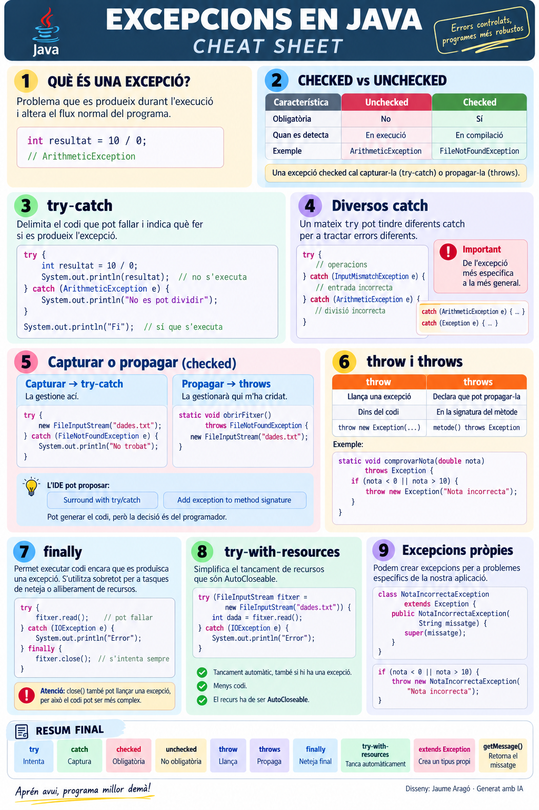

# Excepcions en Java

Una **excepció** és un problema que es produeix durant l'execució d'un programa i que altera el seu flux normal.

Per exemple:

```java
int resultat = 10 / 0;
```

Java no pot realitzar esta operació i genera una:

```text
ArithmeticException
```

Si no controlem l'excepció, el programa interromp la seua execució normal.

---

## 1. `try-catch`: controlar una excepció

Utilitzem:

* `try` → conté el codi que **pot produir una excepció**.
* `catch` → indica **què fer si es produeix**.

```java
try {
    int resultat = 10 / 0;
    System.out.println(resultat);     // no s'executa

} catch (ArithmeticException e) {
    System.out.println("No es pot dividir entre zero");
}

System.out.println("Fi");             // sí que s'executa
```

Quan apareix l'excepció, Java **abandona la resta del `try`**, busca un `catch` compatible i, després de tractar-la, continua l'execució.

```text
        try
         │
    hi ha excepció?
      /       \
    NO         SÍ
    │           │
continua      abandona el try
                │
                ▼
              catch
                │
                ▼
        continua el programa
```

### Diversos `catch`

Un mateix `try` pot tindre diferents `catch` per tractar diferents tipus d'errors:

```java
try {
    // operacions

} catch (InputMismatchException e) {
    // entrada incorrecta

} catch (ArithmeticException e) {
    // divisió incorrecta
}
```

Si utilitzem excepcions específiques i generals, les **més específiques han d'anar primer**:

```java
catch (ArithmeticException e) {
    ...
} catch (Exception e) {
    ...
}
```

---

## 2. Checked i unchecked

Java diferencia entre excepcions **checked** i **unchecked**.

|                                           | **Unchecked**         | **Checked**             |
| ----------------------------------------- | --------------------- | ----------------------- |
| Java obliga a gestionar-la                | No                    | Sí                      |
| El programa pot compilar sense tractar-la | Sí                    | No                      |
| Exemple                                   | `ArithmeticException` | `FileNotFoundException` |

### Unchecked

El compilador no obliga a gestionar-les.

```java
int resultat = 10 / 0;
```

El programa compila, encara que durant l'execució es produirà una `ArithmeticException`.

Altres exemples habituals són:

```text
NullPointerException
InputMismatchException
ArrayIndexOutOfBoundsException
```

### Checked

El compilador obliga a gestionar-les.

Per exemple:

```java
new FileInputStream("dades.txt");
```

Obrir un fitxer pot produir una `FileNotFoundException`.

Java obliga a prendre una decisió:

```text
              EXCEPCIÓ CHECKED
                     │
             ┌───────┴───────┐
             ▼               ▼
         CAPTURAR         PROPAGAR
         try-catch          throws
```

---

## 3. Capturar o propagar

Davant d'una excepció checked hem de decidir **qui s'encarrega de gestionar-la**.

### Capturar → `try-catch`

Capturem l'excepció quan podem gestionar el problema en el mateix lloc.

```java
try {
    new FileInputStream("dades.txt");

} catch (FileNotFoundException e) {
    System.out.println("No s'ha trobat el fitxer");
}
```

L'excepció queda gestionada ací.

### Propagar → `throws`

Propaguem l'excepció quan volem que siga el mètode que ens ha cridat qui decidisca què fer.

```java
public static void obrirFitxer()
        throws FileNotFoundException {

    new FileInputStream("dades.txt");
}
```

La diferència fonamental és:

```text
CAPTURAR                         PROPAGAR

try-catch                        throws
    │                               │
    ▼                               ▼
la gestione ací        la gestionarà qui m'ha cridat
```

### L'IDE ens ajuda

Quan un IDE com IntelliJ IDEA o Eclipse detecta una excepció checked sense gestionar, normalment ofereix opcions semblants a:

```text
Surround with try/catch
        ↓
     CAPTURAR
```

o:

```text
Add exception to method signature
        ↓
     PROPAGAR
```

L'IDE pot generar automàticament el codi, però **la decisió de capturar o propagar és del programador**.


**### Quina diferència hi ha entre capturar i propagar?**

La diferència està en **qui assumeix la responsabilitat de gestionar l'excepció**:

* **Capturar (`try-catch`)** → el mètode **gestiona l'excepció ací mateix** i decideix què fer.
* **Propagar (`throws`)** → el mètode **no gestiona l'excepció** i passa la responsabilitat al mètode que l'ha cridat.

Quan propaguem una excepció, aquesta pot continuar passant d'un mètode a un altre fins que algun d'ells la capture.

Si l'excepció arriba al final sense que ningú la capture, **queda sense gestionar, el programa finalitza i Java mostra la informació de l'excepció**.

Per tant, propagar una excepció **no significa solucionar-la**, sinó deixar que un altre mètode s'encarregue d'ella.

> **Recomanació:** si podem gestionar adequadament el problema en el mètode actual, utilitzem `try-catch`. Si no ens correspon gestionar-lo, utilitzem `throws` i deixem que el mètode que ens ha cridat decidisca què fer.

---

## 4. `throw` i `throws`

Encara que els noms són pareguts, tenen funcions diferents.

| `throw`                    | `throws`                           |
| -------------------------- | ---------------------------------- |
| **Llança** una excepció    | **Declara que pot propagar-la**    |
| Apareix dins del codi      | Apareix en la signatura del mètode |
| `throw new Exception(...)` | `metode() throws Exception`        |

Podem veure els dos conceptes en un mateix exemple:

```java
static void comprovarNota(double nota)
        throws Exception {

    if (nota < 0 || nota > 10) {
        throw new Exception("Nota incorrecta");
    }
}
```

Ací:

```text
throws Exception
       ↓
el mètode declara que pot propagar l'excepció


throw new Exception(...)
       ↓
crea i llança l'excepció
```

Per recordar-ho:

```text
throw  → LLANÇA
throws → DECLARA / PROPAGA
catch  → CAPTURA
```

---

## 5. `finally`

`finally` permet garantir que determinat codi s'intente executar **encara que durant el `try` es produïsca una excepció**.

El seu ús tradicional més important és realitzar **tasques de neteja o alliberament de recursos**.

Suposem que obrim un fitxer:

```java
try {
    fitxer.read();      // pot produir una excepció

    fitxer.close();     // volem tancar el fitxer

} catch (IOException e) {
    System.out.println("Error");
}
```

Si `read()` falla, Java abandona el `try` i no arriba a:

```java
fitxer.close();
```

El recurs podria quedar sense tancar.

Podem utilitzar `finally` per garantir l'intent de tancament:

```java
try {
    fitxer.read();

} catch (IOException e) {
    System.out.println("Error");

} finally {
    // tancar el fitxer
}
```

El funcionament és:

```text
sense excepció ───────────┐
                          ▼
                       finally
                          ▲
amb excepció → catch ─────┘
```

Per tant, `finally` **no s'utilitza simplement per posar codi després d'un `try-catch`**. Té sentit quan necessitem garantir una operació final independentment de com haja acabat el `try`.

En el cas dels fitxers, el tancament manual presenta un altre problema: **`close()` també pot produir una excepció**, cosa que complica el codi.

Per això Java proporciona `try-with-resources`.

---

## 6. `try-with-resources`

`try-with-resources` està pensat per treballar amb recursos que **necessiten tancar-se després d'utilitzar-los**, com els fitxers.

```java
try (FileInputStream fitxer =
        new FileInputStream("dades.txt")) {

    int dada = fitxer.read();

} catch (IOException e) {
    System.out.println("Error");
}
```

El recurs es declara entre els parèntesis del `try`:

```java
try (FileInputStream fitxer =
        new FileInputStream("dades.txt"))
```

En acabar, Java executa automàticament el tancament del recurs.

```text
FORMA TRADICIONAL              TRY-WITH-RESOURCES

finally                              try (recurs)
   │                                      │
   ▼                                      ▼
close() manual                   close() automàtic
```

El tancament automàtic es realitza **també si durant el `try` es produeix una excepció**.

Per poder utilitzar un objecte com a recurs ha de ser compatible amb:

```java
AutoCloseable
```

**Idea clau:** si un recurs és `AutoCloseable`, `try-with-resources` evita haver de controlar manualment el seu `close()`.

---

## 7. Excepcions pròpies

Java proporciona moltes excepcions, però també podem crear-ne de pròpies per representar problemes específics de la nostra aplicació.

Per exemple, podem crear una excepció per a una nota incorrecta:

```java
class NotaIncorrectaException extends Exception {

    public NotaIncorrectaException(String missatge) {
        super(missatge);
    }
}
```

Ara podem utilitzar-la:

```java
static void comprovarNota(double nota)
        throws NotaIncorrectaException {

    if (nota < 0 || nota > 10) {
        throw new NotaIncorrectaException(
                "La nota ha d'estar entre 0 i 10"
        );
    }
}
```

I capturar-la quan siga necessari:

```java
try {
    comprovarNota(15);

} catch (NotaIncorrectaException e) {
    System.out.println(e.getMessage());
}
```

En este exemple apareixen relacionats els conceptes principals:

```text
extends Exception → CREA un tipus d'excepció

throw             → LLANÇA

throws            → PROPAGA

catch             → CAPTURA

getMessage()      → OBTÉ EL MISSATGE
```

---

# En Resum





## Annex — `try-catch` i `try-with-resources`

Quan treballem amb diversos recursos que s'han de tancar, la diferència entre un `try-catch` tradicional i `try-with-resources` es veu més clarament.

En este exemple obrim **dos fitxers**: un d'entrada i un d'eixida.

### Amb `try-catch`

```java
FileInputStream entrada = null;
FileOutputStream eixida = null;

try {
    entrada = new FileInputStream("entrada.txt");
    eixida = new FileOutputStream("eixida.txt");

    // treballar amb els fitxers

} catch (IOException e) {
    System.out.println("Error amb els fitxers");

} finally {
    try {
        if (entrada != null) entrada.close();
        if (eixida != null) eixida.close();

    } catch (IOException e) {
        System.out.println("Error en tancar els fitxers");
    }
}
```

Hem de declarar els recursos fora del `try` i **tancar-los manualment** amb `close()`. A més, el mateix `close()` pot produir una excepció.

### Amb `try-with-resources`

```java
try (FileInputStream entrada =
         new FileInputStream("entrada.txt");
     FileOutputStream eixida =
         new FileOutputStream("eixida.txt")) {

    // treballar amb els fitxers

} catch (IOException e) {
    System.out.println("Error amb els fitxers");
}
```

Podem declarar **diversos recursos** dins dels parèntesis del `try`, separats per `;`.

En acabar el bloc, Java **tanca automàticament tots els recursos**, també si es produeix una excepció.

| `try-catch` tradicional  | `try-with-resources`                    |
| ------------------------ | --------------------------------------- |
| Tancament manual         | Tancament automàtic                     |
| Cal utilitzar `close()`  | No cal escriure `close()`               |
| Pot necessitar `finally` | No necessita `finally` per al tancament |
| Més codi                 | Més simple i segur                      |

> **Recomanació:** quan treballem amb recursos que implementen `AutoCloseable`, és preferible utilitzar `try-with-resources`.


[Exercicis Resolts](<Exemples Resolts Exepcions.html>)

[Examen 1 DAM resolt](examen_excepcions_java.html)