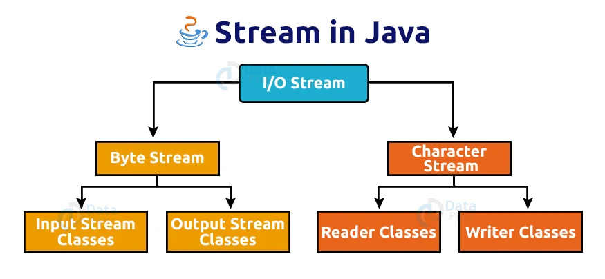

---

title:  Stream
parent: 1.- Gestió del Sistema de Fitxers
grand\_parent: Persistència de Fitxers
has\_children: true
layout: default
nav\_order: 20
--------------

# Fluxos de Dades (Streams) en Java

---

## Introducció

Quan un programa necessita **comunicar-se amb l’exterior** (llegir un fitxer, escriure un informe, rebre dades d’Internet o enviar informació a la consola), necessita un **flux de dades (stream)**.

Un **flux** és un **camí seqüencial** pel qual les dades entren (entrada) o ixen (eixida) del programa.

**Passos bàsics en qualsevol flux:**

1. **Obrir** el flux (crear l’objecte adequat).
2. **Usar** el flux (llegir o escriure).
3. **Tancar** amb `close()` per alliberar recursos.

### Famílies de fluxos

En Java hi ha **dues famílies** segons el tipus de dades que tractes: els **fluxos de bytes** per a informació binària (imatges, vídeos, executables) i els **fluxos de caràcters** per a **text Unicode** (fitxers `.txt`, `.csv`, `.xml`).
Tria **bytes** quan el contingut **no és text** o no vols que l’intèrpret faça conversions d’encoding; tria **caràcters** quan el contingut **és text** i necessites respectar l’**encoding** i la **internacionalització**.

| Família                 | Classe base                    | Unitat de treball           | Ús                                              |
| ----------------------- | ------------------------------ | --------------------------- | ----------------------------------------------- |
| **Fluxos de bytes**     | `InputStream` / `OutputStream` | Byte (8 bits)               | Dades binàries: imatges, vídeos, fitxers `.exe` |
| **Fluxos de caràcters** | `Reader` / `Writer`            | Caràcter (Unicode, 16 bits) | Textos humans: `.txt`, `.csv`, `.xml`           |



---

> **Nota: (encoding):**
> L’**encoding** és la “traducció” **caràcters ⇄ bytes** (ex.: **UTF-8**).
> Per **text**, usa `Reader/Writer` **indicant UTF-8**; per **binari**, `InputStream/OutputStream` (sense conversió).

Entés. Ho deixe **ajustat al que demanes**: només **`java.io`**, **explicació integrada** dins del punt de bones pràctiques, **exemples amb comentaris inline** que indiquen què fan, i en l’últim exemple es veu clarament el **`throws`** (propagació sense `catch`). Mantinc la **vista en 4 punts**.

---

## Bones pràctiques

* **Tanca sempre els fluxos.** Usa **try-with-resources**: és un `try ( … ) { … }` on cada recurs (classe que implementa `AutoCloseable`, com els fluxos d’`java.io`) es **tanca automàticament** en eixir del bloc, **encara que hi haja excepció**, i en **ordre invers** a la declaració. El `catch` és **opcional** (pots capturar o **propagar** amb `throws`).

  ```java
  // Exemple senzill (java.io): llegir bytes d’un fitxer binari
  try (java.io.FileInputStream fis = new java.io.FileInputStream("fitxer.bin")) {
      // ús: llegim el primer byte
      int b = fis.read(); // retorna -1 si s'ha arribat al final
      System.out.println("Primer byte: " + b);
  } // <-- fis.close() es crida automàticament, haja passat el que haja passat
  ```

* **Gestió d’excepcions habituals:**

  * `FileNotFoundException`: el fitxer no existeix o no tens permisos.
  * `EOFException`: lectura més enllà del final (sobretot amb `DataInputStream`).
  * `IOException`: errors generals d’entrada/eixida.

* **`flush()`**: només té sentit en **escriptura**; força a buidar el buffer al disc. (Recorda: `close()` ja fa `flush()`.)

* **Ordre en fluxos encadenats:** si uses `new DataInputStream(new BufferedInputStream(...))`, **tanques només el de fora** (`dis.close()`), i tots els altres es tanquen en **cascada**.

---

### Exemples try-with-resources

**Exemple 1 — Diversos recursos encadenats (lectura binària amb `DataInputStream`)**
El següent codi obri el fitxer, aplica buffer, i llix un `int` (4 bytes) del principi. Si ocorre un error d’E/S, el capturem i informem.

```java
try (FileInputStream fis = new FileInputStream("fitxer.bin");           // 1) font de bytes
     BufferedInputStream bis = new BufferedInputStream(fis);            // 2) buffer per millorar rendiment
     DataInputStream dis = new DataInputStream(bis)) {                   // 3) lectura de tipus primitives

    int x = dis.readInt(); // llix 4 bytes i els interpreta com a int
    System.out.println("Enter llegit: " + x);

} catch (EOFException e) {
    System.out.println("Final de fitxer inesperat.");
} catch (FileNotFoundException e) {
    System.out.println("Fitxer inexistent o sense permisos.");
} catch (IOException e) {
    System.out.println("Error d'entrada/eixida: " + e.getMessage());
}
// Nota: no cal dis.close()/bis.close()/fis.close(): es tanquen sols en ordre invers.
```

**Exemple 2 — Text amb encoding explícit (lectura i escriptura)**
El següent codi obri `in.txt` en mode text amb **UTF-8** (via `InputStreamReader`) i copia línies a `out.txt` amb `BufferedWriter`.
*(Sense `java.nio`; només `java.io`, per això l’encoding s’indica com a String `"UTF-8"`.)*

```java
try (BufferedReader br = new BufferedReader(
         new InputStreamReader(new FileInputStream("in.txt"), "UTF-8"));  // bytes -> caràcters (UTF-8)
     BufferedWriter bw = new BufferedWriter(
         new OutputStreamWriter(new FileOutputStream("out.txt"), "UTF-8"))) { // caràcters -> bytes (UTF-8)

    String linia;
    while ((linia = br.readLine()) != null) { // lectura línia a línia
        bw.write(linia);                       // escrivim la línia al fitxer d’eixida
        bw.newLine();                          // salt de línia de forma portable
    }
    // No cal bw.flush(); close() ja buidarà el buffer

} catch (IOException e) {
    System.out.println("Error d'entrada/eixida: " + e.getMessage());
}
```

**Exemple 3 — Sense `catch`, propagant amb `throws`**
El següent codi crea un CSV simple. Qualsevol `IOException` **no** es captura ací; es **propaga** al cridador gràcies al `throws IOException` en la signatura.

```java
// Propaguem l'excepció: qui cride exportaCSV() haurà de capturar o tornar a propagar
void exportaCSV() throws IOException {
    try (BufferedWriter bw = new BufferedWriter(
             new OutputStreamWriter(new FileOutputStream("dades.csv"), "UTF-8"))) {

        bw.write("id;nom"); bw.newLine();  // capçalera
        bw.write("1;Ana"); bw.newLine();   // fila 1
        bw.write("2;Joan"); bw.newLine();  // fila 2
        // en eixir del try, bw.close() es crida automàticament (també flush)
    } // si hi ha IOException, ix del try i es propaga cap amunt (per 'throws')
}
```

> **En resum:**
>
> * Tanca automàticament **tots** els recursos declarats entre parèntesis, i en **ordre invers**.
> * El `catch` és **opcional**: captura si vols gestionar localment; si no, **posa `throws`** al mètode i que ho gestione qui crida.
> * Per a **text**, especifica l’**encoding** (p. ex. `"UTF-8"`); per a **binari**, treballa directament amb `InputStream`/`OutputStream`.

---

# FLUXOS DE BYTES

*(Totes les classes deriven d’`InputStream` i `OutputStream`)*

Els fluxos de bytes treballen amb dades **binàries pures**. No interpreten res com a text.

Són ideals per a:

* Imatges, vídeos, PDF.
* Fitxers `.dat` amb dades primitives.
* Còpia d’arxius byte a byte.

---

## 1. Lectura binària (InputStream)

### 1.1 FileInputStream

**Usarem esta classe per:** llegir directament bytes d’un fitxer.

**Constructors habituals (descripció breu):**

* `FileInputStream(String path)`  : obri el fitxer ubicat en el camí indicat, en **lectura binària**.
* `FileInputStream(File file)`    : igual, però rep un **objecte `File`** previ.

**Excepcions requerides (checked):**

* Els constructors **llancen `FileNotFoundException`** si el fitxer no existeix o no hi ha permisos.
* Les lectures (`read…`) **llancen `IOException`**; cal `try/catch` o `throws`.

**Mètodes:**

* **`int read()`** → llig un byte del fitxer i el retorna com un enter entre 0 i 255. Retorna `-1` si s’ha arribat al final.
  *Ús*: quan volem processar dades byte a byte.
* **`int read(byte[] b)`** → intenta omplir l’array `b` amb bytes del fitxer i retorna quants n’ha llegit realment.
  *Ús*: més eficient que `read()` a soles, perquè fa menys crides al disc.
* **`int read(byte[] b, int off, int len)`** → igual que l’anterior, però ompli només una part de l’array, des de la posició `off` i fins `len` bytes.
* **`long skip(long n)`** → intenta saltar `n` bytes sense llegir-los. No sempre salta exactament els `n` bytes (retorna quants ha saltat).
* **`int available()`** → retorna quants bytes es poden llegir sense bloquejar (no és el total que queda en el fitxer!).
* **`void close()`** → tanca el flux i allibera el descriptor de fitxer.

**Quan triar-la:** per a lectures binàries senzilles.
**Quan evitar-la:** per a fitxers grans (millor `BufferedInputStream`).

**Exemple:** llegir i mostrar bytes.

```java
try (FileInputStream fis = new FileInputStream("logo.png")) {
    int b;
    while ((b = fis.read()) != -1) {      // llegim byte a byte
        System.out.println(b);            // mostrem el valor
    }
}
```

**Al codi anterior:**

1. `new FileInputStream("logo.png")` → obrim el fitxer `logo.png` en mode lectura binària.
2. `int b;` → declarem una variable per guardar cada byte llegit.
3. `while ((b = fis.read()) != -1)` → bucle que llig byte a byte fins al final del fitxer (`-1`).
4. `System.out.println(b);` → mostra cada byte com un número enter (0–255).
5. `try-with-resources` → tanca automàticament `fis` al final, encara que hi haja errors.

---

### 1.2 BufferedInputStream

**Usarem esta classe per:** millorar la velocitat de lectura amb un buffer intern.

**Constructor (descripció breu):**

* `BufferedInputStream(InputStream in)` — embolica un `InputStream` i afegeix buffer.

**Excepcions requerides (checked):**

* Les operacions de lectura **llancen `IOException`** (cal `try/catch` o `throws`).

**Mètodes:**

* **`int read()` / `int read(byte[] b)`** → funcionen com a `FileInputStream`, però llegint d’un **buffer en memòria** que redueix l’accés al disc.
* **`void mark(int readlimit)`** → marca la posició actual en el flux. Es pot tornar a ella després amb `reset()`. El paràmetre `readlimit` indica quants bytes podem llegir abans de perdre la marca.
* **`void reset()`** → torna a la posició marcada amb `mark()`.
* **`boolean markSupported()`** → diu si el flux suporta `mark/reset`. En `BufferedInputStream` és `true`.
* **`void close()`** → tanca el flux i buida el buffer intern.

**Quan triar-la:** fitxers grans, lectures repetides.
**Quan evitar-la:** fitxers menuts.

**Exemple:** llegir amb buffer.

```java
try (BufferedInputStream bis =
         new BufferedInputStream(new FileInputStream("video.mp4"))) {
    byte[] buf = new byte[4096];
    int n;
    while ((n = bis.read(buf)) != -1) {
        System.out.println("Llegits " + n + " bytes");
    }
}
```

**Al codi anterior:**

1. `new FileInputStream("video.mp4")` → obrim el fitxer de vídeo en mode lectura.
2. `new BufferedInputStream(...)` → emboliquem el flux amb un buffer de memòria.
3. `byte[] buf = new byte[4096];` → creem un array de 4 KB per llegir blocs sencers.
4. `bis.read(buf)` → llig fins a 4096 bytes en cada iteració; retorna el nombre real llegit.
5. `while ((n = bis.read(buf)) != -1)` → bucle que continua fins al final.
6. `System.out.println("Llegits " + n + " bytes");` → mostra quants bytes s’han llegit cada volta.

---

### 1.3 DataInputStream

**Usarem esta classe per:** llegir dades primitives (int, double, String) en format binari.

**Constructor (descripció breu):**

* `DataInputStream(InputStream in)` — embolica un `InputStream` per a primitives.

**Excepcions requerides (checked):**

* Lectures **llancen `IOException`** (i, segons el cas, `EOFException`).

**Mètodes:**

* **`boolean readBoolean()`**, **`byte readByte()`**, **`char readChar()`**, **`short readShort()`**, **`int readInt()`**, **`long readLong()`**, **`float readFloat()`**, **`double readDouble()`** → lligen primitives en el mateix format binari en què es van escriure amb `DataOutputStream`.
* **`String readUTF()`** → llig una cadena codificada en *Modified UTF-8*. Només funciona correctament si es va escriure amb `writeUTF()`.
* **`void close()`** → tanca el flux.

**Important**: l’ordre de lectura ha de coincidir exactament amb l’ordre d’escriptura.

**Quan triar-la:** per a fitxers `.dat` amb registres.
**Quan evitar-la:** quan no controles l’ordre d’escriptura.

**Exemple:** llegir alumnes.

```java
try (DataInputStream dis = new DataInputStream(
         new BufferedInputStream(new FileInputStream("notes.dat")))) {
    int n = dis.readInt();
    for (int i = 0; i < n; i++) {
        long id = dis.readLong();
        String nom = dis.readUTF();
        double nota = dis.readDouble();
        System.out.printf("%d %s %.2f%n", id, nom, nota);
    }
}
```

**Al codi anterior:**

1. Obrim el fitxer `notes.dat` amb `FileInputStream`.
2. L’emboliquem amb `BufferedInputStream` per fer-lo més ràpid.
3. L’emboliquem amb `DataInputStream` per poder llegir primitives.
4. `dis.readInt()` → llegim el nombre de registres guardats.
5. Recorrem amb un bucle:

   * `readLong()` → llegim un identificador.
   * `readUTF()` → llegim un nom.
   * `readDouble()` → llegim una nota.
6. `System.out.printf(...)` → mostrem els valors amb format.
7. Tancament automàtic amb `try-with-resources`.

---

## 2. Escriptura binària (OutputStream)

### 2.1 FileOutputStream

**Usarem esta classe per:** escriure bytes en un fitxer.

**Constructors habituals:**

* `FileOutputStream(String path)` → sobreescriu.
* `FileOutputStream(String path, boolean append)` → si true, afegeix.

**Excepcions requerides (checked):**

* Constructors i escriptura **llancen `FileNotFoundException`/`IOException`**.

**Mètodes:**

* **`void write(int b)`** → escriu un byte. Només els 8 bits baixos del valor de l’enter es guarden.
* **`void write(byte[] b)`** → escriu tot l’array de bytes `b`.
* **`void write(byte[] b, int off, int len)`** → escriu només una part de l’array, des de la posició `off` i durant `len` bytes.
* **`void flush()`** → força a guardar les dades escrites al sistema de fitxers immediatament.
* **`void close()`** → tanca el flux i allibera recursos. Ja fa un `flush()` automàtic.

**Quan triar-la:** dades simples.
**Quan evitar-la:** sense buffer en fitxers grans.

**Exemple:** escriure bytes.

```java
try (FileOutputStream fos = new FileOutputStream("dades.bin")) {
    fos.write(new byte[]{10,20,30});
}
```

**Al codi anterior:**

1. `new FileOutputStream("dades.bin")` → crea (o sobreescriu) el fitxer binari.
2. `fos.write(new byte[]{10,20,30});` → escriu tres bytes amb valors 10, 20 i 30.
3. `try-with-resources` → es tanca automàticament el flux.

---

### 2.2 BufferedOutputStream

**Usarem esta classe per:** millorar l’eficiència amb buffer.

**Constructor (descripció breu):**

* `BufferedOutputStream(OutputStream out)` — embolica un `OutputStream` amb buffer.

**Excepcions requerides (checked):**

* Escriptures i `flush/close` **llancen `IOException`**.

**Mètodes:**

* **`void write(int b)` / `void write(byte[] b)` / `void write(byte[] b, int off, int len)`** → escriuen dades en el buffer intern i les guarden al disc només quan el buffer està ple o es crida `flush()`.
* **`void flush()`** → obliga a escriure totes les dades que queden al buffer encara que no estiga ple.
* **`void close()`** → tanca el flux i escriu qualsevol dada pendent.

**Exemple:** escriure bloc gran.

```java
try (BufferedOutputStream bos =
         new BufferedOutputStream(new FileOutputStream("gran_sortida.bin"))) {
    byte[] bloc = new byte[8192];
    bos.write(bloc);
}
```

**Al codi anterior:**

1. `new FileOutputStream("gran_sortida.bin")` → obrim un fitxer per escriure.
2. `new BufferedOutputStream(...)` → afegim un buffer per agrupar l’escriptura.
3. `new byte[8192]` → creem un bloc de 8 KB inicialitzat a zeros.
4. `bos.write(bloc);` → escriu tot el bloc en memòria i després l’envia al fitxer.

---

### 2.3 DataOutputStream

**Usarem esta classe per:** escriure primitives en binari.

**Constructor (descripció breu):**

* `DataOutputStream(OutputStream out)` — embolica un `OutputStream` per a primitives.

**Excepcions requerides (checked):**

* Escriptures **llancen `IOException`**.

**Mètodes:**

* **`void writeBoolean(boolean v)`, `writeByte(byte v)`, `writeChar(char v)`, `writeShort(short v)`, `writeInt(int v)`, `writeLong(long v)`, `writeFloat(float v)`, `writeDouble(double v)`** → escriuen valors primitius en binari.
* **`void writeUTF(String s)`** → escriu una cadena en format *Modified UTF-8*. Ha de ser llegida amb `readUTF()`.
* **`void flush()`** → força a escriure el buffer immediatament.
* **`void close()`** → tanca el flux.

**Important**: cal respectar sempre l’ordre i el tipus de dades quan després es llig amb `DataInputStream`.

**Quan triar-la:** guardar registres binaris.
**Quan evitar-la:** si necessites compatibilitat amb altres llenguatges.

**Exemple:** guardar alumnes.

```java
try (DataOutputStream dos = new DataOutputStream(
         new BufferedOutputStream(new FileOutputStream("notes.dat")))) {
    dos.writeInt(2);
    dos.writeLong(1L); dos.writeUTF("Anna"); dos.writeDouble(9.5);
    dos.writeLong(2L); dos.writeUTF("Marc"); dos.writeDouble(7.8);
}
```

**Al codi anterior:**

1. Obrim el fitxer `notes.dat` amb `FileOutputStream`.
2. L’emboliquem amb `BufferedOutputStream` per fer-lo més eficient.
3. L’emboliquem amb `DataOutputStream` per poder escriure primitives.
4. `dos.writeInt(2);` → indiquem que hi haurà 2 registres.
5. Primer registre: `writeLong(1L)`, `writeUTF("Anna")`, `writeDouble(9.5)`.
6. Segon registre: `writeLong(2L)`, `writeUTF("Marc")`, `writeDouble(7.8)`.
7. `try-with-resources` → es tanca automàticament.

---

# FLUXOS DE CARÀCTERS

*(Totes les classes deriven de `Reader` i `Writer`)*

Els fluxos de caràcters interpreten els bytes com a **text**, segons un **charset** (UTF-8, ISO...).

Són ideals per a:

* Fitxers `.txt`, `.csv`, `.xml`, `.json`.
* Qualsevol informació llegible per humans.

---

## Nota sobre FileReader/FileWriter

Aquestes classes usen **charset del sistema** → pot fallar amb accents.

**Pitjor pràctica:**

```java
FileReader fr = new FileReader("entrada.txt"); // depén del sistema
```

**Millor pràctica:**

```java
new InputStreamReader(new FileInputStream("entrada.txt"), StandardCharsets.UTF_8);
```

---

## 1. Lectura de text (Reader)

### 1.1 FileReader

**Usarem esta classe per:** llegir caràcters amb charset del sistema.

**Excepcions requerides (checked):**

* Constructors/lectures **llancen `FileNotFoundException`/`IOException`**.

**Mètodes:**

* **`int read()`** → llig un caràcter i el retorna com a enter Unicode. Retorna `-1` si arriba al final.
* **`int read(char[] cbuf)`** → llig diversos caràcters i els guarda en l’array. Retorna quants n’ha llegit.
* **`int read(char[] cbuf, int off, int len)`** → com l’anterior però en una porció de l’array.
* **`boolean ready()`** → diu si hi ha caràcters disponibles per llegir sense bloquejar.
* **`void close()`** → tanca el flux.

Usa el **charset del sistema**, pot donar problemes amb accents.

**Exemple:**

```java
try (FileReader fr = new FileReader("poema.txt")) {
    char[] buf = new char[256];
    int n;
    while ((n = fr.read(buf)) != -1) {
        System.out.print(new String(buf, 0, n));
    }
}
```

**Al codi anterior:**

1. `new FileReader("poema.txt")` → obrim el fitxer en mode lectura de caràcters.
2. `char[] buf = new char[256];` → reservem un buffer de 256 caràcters.
3. `fr.read(buf)` → ompli el buffer amb caràcters llegits i retorna quants n’ha llegit.
4. `while ((n = fr.read(buf)) != -1)` → bucle que continua fins al final.
5. `System.out.print(new String(buf, 0, n))` → construïm una cadena amb els caràcters llegits i la mostrem.
6. `try-with-resources` → tanca automàticament el flux.

---

### 1.2 BufferedReader

**Usarem esta classe per:** llegir línies amb `readLine()`.

**Excepcions requerides (checked):**

* Lectures **llancen `IOException`**.

**Mètodes:**

* **`String readLine()`** → llig una línia sencera (sense incloure el salt de línia). Retorna `null` si arriba al final.
* **`int read()` / `int read(char[] cbuf)`** → llig caràcters de manera més eficient gràcies al buffer.
* **`void mark(int readAheadLimit)`** → marca la posició actual, permetent tornar-hi amb `reset()`.
* **`void reset()`** → torna a la posició marcada.
* **`boolean markSupported()`** → retorna `true`.
* **`void close()`** → tanca el flux.

**Exemple:**

```java
try (BufferedReader br = new BufferedReader(new FileReader("entrada.txt"))) {
    String linia;
    while ((linia = br.readLine()) != null) {
        System.out.println(linia);
    }
}
```

**Al codi anterior:**

1. `new FileReader("entrada.txt")` → obrim el fitxer en mode lectura.
2. `new BufferedReader(...)` → afegim un buffer per optimitzar i permetre `readLine()`.
3. `br.readLine()` → retorna una línia completa o `null` si ja no hi ha més.
4. `while ((linia = br.readLine()) != null)` → bucle fins al final.
5. `System.out.println(linia);` → mostra cada línia per consola.
6. El flux es tanca automàticament al final.

---

### 1.3 InputStreamReader

**Usarem esta classe per:** convertir bytes a caràcters amb charset.

**Excepcions requerides (checked):**

* Lectures **llancen `IOException`**.

**Mètodes:**

* **`int read()` / `int read(char[] cbuf)`** → converteix bytes d’un `InputStream` en caràcters segons el charset especificat.
* **`boolean ready()`** → diu si hi ha caràcters disponibles per llegir.
* **`String getEncoding()`** → retorna el nom del charset usat.
* **`void close()`** → tanca el flux.

**Exemple:**

```java
try (BufferedReader br = new BufferedReader(
         new InputStreamReader(new FileInputStream("text_utf8.txt"), StandardCharsets.UTF_8))) {
    String linia;
    while ((linia = br.readLine()) != null) {
        System.out.println(linia);
    }
}
```

**Al codi anterior:**

1. `new FileInputStream("text_utf8.txt")` → obrim el fitxer en mode binari.
2. `new InputStreamReader(..., StandardCharsets.UTF_8)` → convertim bytes a caràcters amb el charset UTF-8.
3. `new BufferedReader(...)` → afegim la lectura per línies amb buffer.
4. `br.readLine()` → llig línies de text en UTF-8 correctament.
5. `while (...)` → recorrem fins al final.
6. `System.out.println(linia)` → mostrem el text.

---

## 2. Escriptura de text (Writer)

### 2.1 FileWriter

**Usarem esta classe per:** escriure caràcters amb charset del sistema.

**Excepcions requerides (checked):**

* Constructors/escriptura **llancen `IOException`**.

**Mètodes:**

* **`void write(String s)`** → escriu una cadena completa en el fitxer.
* **`void write(char[] cbuf, int off, int len)`** → escriu només part d’un array de caràcters.
* **`void flush()`** → força a escriure les dades pendents al fitxer.
* **`void close()`** → tanca el flux i aboca les dades restants.

Usa el **charset del sistema** per defecte.

**Exemple:**

```java
try (FileWriter fw = new FileWriter("nota.txt")) {
    fw.write("Hola món");
}
```

**Al codi anterior:**

1. `new FileWriter("nota.txt")` → crea o sobreescriu el fitxer en mode text.
2. `fw.write("Hola món")` → escriu la cadena.
3. El fitxer es tanca automàticament i es guarden les dades.

---

### 2.2 BufferedWriter

**Usarem esta classe per:** escriure línies.

**Excepcions requerides (checked):**

* Escriptures/flush/close **llancen `IOException`**.

**Mètodes:**

* **`void write(String s)` / `write(char[] cbuf, int off, int len)`** → escriuen text de forma més eficient gràcies al buffer.
* **`void newLine()`** → escriu un salt de línia segons el sistema operatiu (portàtil, millor que `\n`).
* **`void flush()`** → força a escriure les dades que hi ha al buffer.
* **`void close()`** → tanca el flux.

**Exemple:**

```java
try (BufferedWriter bw = new BufferedWriter(new FileWriter("sortida.txt"))) {
    bw.write("Primera línia");
    bw.newLine();
    bw.write("Segona línia");
}
```

**Al codi anterior:**

1. `new FileWriter("sortida.txt")` → obrim fitxer de text.
2. `new BufferedWriter(...)` → millorem l’eficiència d’escriptura.
3. `bw.write("Primera línia")` → escriu text.
4. `bw.newLine()` → inserix salt de línia.
5. `bw.write("Segona línia")` → escriu més text.
6. Al tancar-se, s’escriu tot al disc.

---

### 2.3 OutputStreamWriter

**Usarem esta classe per:** escriure text amb charset concret.

**Excepcions requerides (checked):**

* Escriptura/flush/close **llancen `IOException`**.

**Mètodes:**

* **`void write(String s)` / `write(char[] cbuf, int off, int len)`** → escriu caràcters convertint-los a bytes segons el charset indicat.
* **`String getEncoding()`** → retorna el charset realment en ús.
* **`void flush()`** → força a escriure dades pendents.
* **`void close()`** → tanca el flux.

**Exemple:**

```java
try (OutputStreamWriter osw =
         new OutputStreamWriter(new FileOutputStream("resum.txt"), StandardCharsets.UTF_8)) {
    osw.write("Accents i caràcters: informació, valència");
}
```

**Al codi anterior:**

1. `new FileOutputStream("resum.txt")` → crea el fitxer en mode binari.
2. `new OutputStreamWriter(..., UTF_8)` → converteix caràcters a bytes amb codificació UTF-8.
3. `osw.write(...)` → escriu la cadena amb accents.
4. El tancament guarda les dades al disc.

---

### 2.4 PrintWriter

**Usarem esta classe per:** escriure amb format.

**Excepcions requerides (checked):**

* Les operacions d’escriptura **no llancen checked** directament; comprova amb `checkError()`.

**Mètodes:**

* **`void print(String s)`** → escriu un text sense salt de línia.
* **`void println(String s)`** → escriu text i després un salt de línia.
* **`PrintWriter printf(String fmt, Object... args)` / `format(...)`** → escriu text amb format (semblant a `printf` de C).
* **`boolean checkError()`** → comprova si ha passat algun error d’escriptura.
* **`void flush()`** → força l’escriptura immediata.
* **`void close()`** → tanca el flux.
* *(Constructor amb `autoFlush=true`)* → fa que cada `println()` o `printf()` aboque automàticament.

**Exemple:**

```java
try (PrintWriter pw = new PrintWriter(new BufferedWriter(new FileWriter("informe.txt")))) {
    pw.println("ID\tNom\tNota");
    pw.printf("%d\t%s\t%.2f%n", 1, "Anna", 9.25);
}
```

**Al codi anterior:**

1. Obrim `informe.txt` amb `FileWriter`.
2. L’emboliquem amb `BufferedWriter` i `PrintWriter`.
3. `pw.println(...)` → escriu la capçalera.
4. `pw.printf(...)` → escriu un registre amb format.
5. Al tancar, es guarden les dades.

---

## 3. Combinacions habituals (text) amb exemples

**Lectura simple:**

```java
try (BufferedReader br = new BufferedReader(new FileReader("entrada.txt"))) {
    String linia;
    while ((linia = br.readLine()) != null) {
        System.out.println(linia);
    }
}
```

**Al codi anterior:**

1. `FileReader` → lectura de text.
2. `BufferedReader` → permet `readLine()`.
3. Llegim línies fins a `null`.

---

**Lectura amb charset:**

```java
try (BufferedReader br = new BufferedReader(
         new InputStreamReader(new FileInputStream("entrada.txt"), StandardCharsets.UTF_8))) {
    String linia;
    while ((linia = br.readLine()) != null) {
        System.out.println(linia);
    }
}
```

**Al codi anterior:**

1. `FileInputStream` → obri el fitxer en bytes.
2. `InputStreamReader(..., UTF-8)` → converteix a caràcters.
3. `BufferedReader` → lectura per línies.

---

**Escriptura simple:**

```java
try (BufferedWriter bw = new BufferedWriter(new FileWriter("sortida.txt"))) {
    bw.write("Primera línia");
    bw.newLine();
    bw.write("Segona línia");
}
```

**Al codi anterior:**

1. `FileWriter` → crea un fitxer de text.
2. `BufferedWriter` → millora eficiència i permet `newLine()`.
3. Escrivim dues línies.

---

**Escriptura amb charset:**

```java
try (BufferedWriter bw = new BufferedWriter(
         new OutputStreamWriter(new FileOutputStream("sortida_utf8.txt"), StandardCharsets.UTF_8))) {
    bw.write("Accents: àèíòú ç ñ");
}
```

**Al codi anterior:**

1. `FileOutputStream` → crea fitxer en bytes.
2. `OutputStreamWriter(..., UTF-8)` → converteix caràcters a UTF-8.
3. `BufferedWriter` → escriu text eficientment.

---

**Escriptura amb format:**

```java
try (PrintWriter pw = new PrintWriter(new BufferedWriter(new FileWriter("informe.txt")))) {
    pw.printf("%d\t%s\t%.2f%n", 1, "Anna", 9.25);
    pw.printf("%d\t%s\t%.2f%n", 2, "Marc", 7.80);
}
```

**Al codi anterior:**

1. Obrim fitxer de text amb `FileWriter`.
2. Afegim `BufferedWriter` i `PrintWriter`.
3. `printf` → imprimeix línies amb format i decimals.

---

# Streams estàndard

**`System.in`** → entrada de consola (`InputStream`).
Exemple:

```java
try (BufferedReader br = new BufferedReader(new InputStreamReader(System.in))) {
    System.out.print("Introdueix el teu nom: ");
    String nom = br.readLine();
    System.out.println("Hola " + nom);
}
```

**Al codi anterior:**

1. `System.in` → entrada de consola en bytes.
2. `InputStreamReader(..., UTF-8)` → converteix a caràcters.
3. `BufferedReader` → llegim una línia.
4. Mostrem un missatge personalitzat.

---

**`System.out`** → sortida consola (`PrintStream`), amb `print`, `println`, `printf`.

**`System.err`** → errors de consola.
Exemple:

```java
System.err.println("Error: fitxer no trobat");
```

**Al codi anterior:**

1. `System.err` → canal separat per a errors.
2. Mostra un missatge independent de l’eixida normal (`System.out`).

---

# En resum

* **Fluxos de bytes** (`InputStream`/`OutputStream`) → dades binàries.
* **Fluxos de caràcters** (`Reader`/`Writer`) → text.
* **Buffered** → rendiment.
* **Data Stream** → primitives binàries.
* **StreamReader/Writer** → control de charset.
* **PrintWriter** → text amb format.
* **try-with-resources** i **gestió d’excepcions** → bones pràctiques.


# ANNEX

## Patró de disseny: **Decorator** (aplicat als Streams)

**Ideia clau:** en Java I/O, quasi tots els “*streams* decoradors” **emboliquen** un altre stream per **afegir funcionalitats** sense heretar-ne el codi.
Això et permet **compondre capes**: comences amb un **stream base** (accés a origen/destinació) i hi afegixes decoradors (buffer, primitives, text, línies, format…).

### Per què usar-lo ací?

* **Flexibilitat:** combina només el que necessites (buffer? text? format?).
* **Reutilització:** capes independents i intercanviables.
* **Simplicitat:** tanques **només** la capa externa; la resta es tanquen en cascada.

---

### Peces (amb les classes de streams)

* **Components base (bytes)**: `FileInputStream`, `FileOutputStream`
  
* **Decoradors de bytes**:
  `BufferedInputStream`, `BufferedOutputStream` (buffer de rendiment)
  `DataInputStream`, `DataOutputStream` (tipus primitius binaris)

* **“Pont” bytes→caràcters** (*bridges* que també actuen com a decoradors):
  `InputStreamReader` (llegir text amb charset), `OutputStreamWriter` (escriure text amb charset)

* **Decoradors de caràcters (text)**:
  `BufferedReader` (línies i buffer de lectura), `BufferedWriter` (buffer d’escriptura), `PrintWriter` (format)

---

### Regla d’ORDE recomanada de capes

1. **Base (bytes)** → 2) **Buffer/Primitives (bytes)** → 3) **Pont a text (si cal)** → 4) **Decoradors de text** → 5) **Format (si cal)**

* **Lectura binària típica:** `FileInputStream` → `BufferedInputStream` → `DataInputStream`
* **Lectura de text típica:** `FileInputStream` → `InputStreamReader(UTF-8)` → `BufferedReader`
* **Escriptura binària típica:** `FileOutputStream` → `BufferedOutputStream` → `DataOutputStream`
* **Escriptura de text típica:** `FileOutputStream` → `OutputStreamWriter(UTF-8)` → `BufferedWriter` → `PrintWriter` *(opcional)*

> **Nota:** Si vas a **text**, el **pont** (`InputStreamReader`/`OutputStreamWriter`) ha d’anar **abans** dels decoradors de text.

---

### Combinacions possibles (amb les classes dels apunts)

**Lectura (bytes / text):**

* `FileInputStream`
* `FileInputStream` → `BufferedInputStream`
* `FileInputStream` → `DataInputStream`
* `FileInputStream` → `BufferedInputStream` → `DataInputStream`
* `FileInputStream` → `InputStreamReader(UTF-8)`
* `FileInputStream` → `InputStreamReader(UTF-8)` → `BufferedReader`

**Escriptura (bytes / text):**

* `FileOutputStream`
* `FileOutputStream` → `BufferedOutputStream`
* `FileOutputStream` → `DataOutputStream`
* `FileOutputStream` → `BufferedOutputStream` → `DataOutputStream`
* `FileOutputStream` → `OutputStreamWriter(UTF-8)`
* `FileOutputStream` → `OutputStreamWriter(UTF-8)` → `BufferedWriter`
* `FileOutputStream` → `OutputStreamWriter(UTF-8)` → `BufferedWriter` → `PrintWriter`

> Tècnicament podriem fer variacions (p. ex. `FileInputStream` → `BufferedInputStream` → `InputStreamReader(UTF-8)` → `BufferedReader`), però **no** té gaire sentit posar dos buffers seguits en la mateixa direcció de dades; amb **un** n’hi ha prou.

---

## Exemples més usats

### A) Lectura BINÀRIA amb buffer + primitives

**Combinació:** `FileInputStream` → `BufferedInputStream` → `DataInputStream`

```java
try (FileInputStream fis = new FileInputStream("notes.dat");      // base: bytes des del fitxer
     BufferedInputStream bis = new BufferedInputStream(fis);      // decorador: buffer de lectura
     DataInputStream dis = new DataInputStream(bis)) {            // decorador: llegir tipus primitius

    int n = dis.readInt();                                        // primer camp: quants registres hi ha
    for (int i = 0; i < n; i++) {
        long id = dis.readLong();                                 // llegim un long
        String nom = dis.readUTF();                               // llegim un String (Modified UTF-8)
        double nota = dis.readDouble();                           // llegim un double
        System.out.printf("%d %s %.2f%n", id, nom, nota);         // eixida per consola
    }

} catch (EOFException e) {
    System.out.println("Final de fitxer inesperat.");
} catch (FileNotFoundException e) {
    System.out.println("Fitxer inexistent o sense permisos.");
} catch (IOException e) {
    System.out.println("Error d'entrada/eixida: " + e.getMessage());
}
```

**Al codi anterior:**

1. **Base** (`FileInputStream`) per llegir bytes del fitxer.
2. **Buffer** (`BufferedInputStream`) per reduir accessos a disc.
3. **Primitives** (`DataInputStream`) per llegir *int/long/double/String* en binari.
4. L’ordre de lectura **ha de coincidir** amb l’ordre d’escriptura.

---

### B) Lectura de TEXT amb charset + línies

**Combinació:** `FileInputStream` → `InputStreamReader(UTF-8)` → `BufferedReader`

```java
try (BufferedReader br = new BufferedReader(
         new InputStreamReader(new FileInputStream("entrada.txt"), "UTF-8"))) {
    String linia;
    while ((linia = br.readLine()) != null) {                     // llegim línia a línia
        System.out.println(linia);                                // mostrem el text
    }
} catch (IOException e) {
    System.out.println("Error d'entrada/eixida: " + e.getMessage());
}
```

**Al codi anterior:**

1. **Base** bytes (`FileInputStream`).
2. **Pont** (`InputStreamReader("UTF-8")`) per convertir bytes→caràcters amb encoding controlat.
3. **Decorador de text** (`BufferedReader`) per a `readLine()` i rendiment en text.

---

### C) Escriptura BINÀRIA amb buffer + primitives

**Combinació:** `FileOutputStream` → `BufferedOutputStream` → `DataOutputStream`

```java
try (DataOutputStream dos = new DataOutputStream(
         new BufferedOutputStream(new FileOutputStream("notes.dat")))) {

    dos.writeInt(2);                                              // escriurem 2 registres
    dos.writeLong(1L); dos.writeUTF("Anna"); dos.writeDouble(9.5);
    dos.writeLong(2L); dos.writeUTF("Marc"); dos.writeDouble(7.8);
    // tancant la capa externa, es fa flush i es tanquen totes les capes
} catch (IOException e) {
    System.out.println("Error d'entrada/eixida: " + e.getMessage());
}
```

**Al codi anterior:**

1. **Base** (`FileOutputStream`) per escriure bytes.
2. **Buffer** (`BufferedOutputStream`) per agrupar escriptures.
3. **Primitives** (`DataOutputStream`) per escriure *int/long/double/String* en binari.
4. Respecta l’**ordre** de camps si després els llegiràs amb `DataInputStream`.

---

### D) Escriptura de TEXT amb charset + línies + format

**Combinació:** `FileOutputStream` → `OutputStreamWriter(UTF-8)` → `BufferedWriter` → `PrintWriter`

```java
try (PrintWriter pw = new PrintWriter(
         new BufferedWriter(
             new OutputStreamWriter(new FileOutputStream("informe.txt"), "UTF-8")))) {

    pw.println("ID\tNom\tNota");                                  // capçalera amb tabuladors
    pw.printf("%d\t%s\t%.2f%n", 1, "Anna", 9.25);                 // línia amb format
    pw.printf("%d\t%s\t%.2f%n", 2, "Marc", 7.80);
    // PrintWriter pot fer buffer (via BufferedWriter) i format (printf)
} 
// PrintWriter/BufferedWriter/OutputStreamWriter/FileOutputStream es tanquen en cascada
```

**Al codi anterior:**

1. **Base** (`FileOutputStream`).
2. **Pont** (`OutputStreamWriter("UTF-8")`) per convertir caràcters→bytes amb encoding correcte.
3. **Decorador de text** (`BufferedWriter`) per rendiment.
4. **Format** (`PrintWriter`) per `print/println/printf` còmode.

---

### Trucs pràctics (Decorator amb Streams)

* **Tanca només la capa externa**; la resta es tanquen **en cascada** (patró Decorator facilita això).
* **Un sol buffer** per direcció sol ser suficient (`BufferedInputStream` o `BufferedReader`; `BufferedOutputStream` o `BufferedWriter`).
* **Encoding sempre explícit** quan passes a text (`"UTF-8"`), per a evitar sorpreses.
* **Capturar o propagar?** `catch` és **opcional**: si no gestiones ací, declara `throws IOException` al mètode.
* **Coherència binari/text:** una vegada creues el **pont** (Input/OutputStreamReader), ja estàs en **caràcters**; continua amb decoradors de **text** (no barreges `Data*Stream` després del *reader/writer*).


## Resum -- Fluxos en Java 

**Què són els streams?**
Són canals seqüencials d’**entrada/eixida** per llegir o escriure dades. Sempre: **obrir → usar → tancar** (`close()` o millor `try-with-resources`).

**Dues famílies:**

* **Bytes** (`InputStream`/`OutputStream`): dades binàries (imatges, vídeos, `.dat`). No hi ha conversió de text.
* **Caràcters** (`Reader`/`Writer`): **text Unicode**. Indica **charset** (recomanat `UTF-8`) amb `InputStreamReader`/`OutputStreamWriter`.

**Decorador (pattern):**
Java I/O compon capes: **base** (File*Stream) + **decoradors** (Buffered*, Data\*, Reader/Writer, PrintWriter). Pots combinar segons necessitat (buffer, primitives, text, format). **Tanca només la capa externa**.

**Bones pràctiques (flash):**

* `try-with-resources` (tanca automàticament; `catch` opcional).
* Un **sol buffer** per direcció sol ser suficient.
* En text, **charset explícit**.
* Amb `Data*Stream`, respecta **ordre i tipus** de camps.

---

## Taules resum de fluxos (bytes i caràcters)

### Lectura — **bytes** (`InputStream`)

| Classe                | Propòsit                                    | Mètodes principals                                                                                                                           |
| --------------------- | ------------------------------------------- | -------------------------------------------------------------------------------------------------------------------------------------------- |
| `FileInputStream`     | Llegir bytes d’un fitxer.                   | `read()`, `read(byte[])`, `read(byte[],off,len)`, `skip(n)`, `available()`, `close()`                                                        |
| `BufferedInputStream` | Afegir **buffer** per a lectura més ràpida. | `read()`, `read(byte[])`, `mark(readlimit)`, `reset()`, `markSupported()`, `close()`                                                         |
| `DataInputStream`     | Llegir **primitives** en binari.            | `readBoolean()`, `readByte()`, `readChar()`, `readShort()`, `readInt()`, `readLong()`, `readFloat()`, `readDouble()`, `readUTF()`, `close()` |

### Escriptura — **bytes** (`OutputStream`)

| Classe                 | Propòsit                           | Mètodes principals                                                                                                                                                        |
| ---------------------- | ---------------------------------- | ------------------------------------------------------------------------------------------------------------------------------------------------------------------------- |
| `FileOutputStream`     | Escriure bytes en fitxer.          | `write(int)`, `write(byte[])`, `write(byte[],off,len)`, `flush()`, `close()`                                                                                              |
| `BufferedOutputStream` | Afegir **buffer** d’escriptura.    | `write(int)`, `write(byte[])`, `write(byte[],off,len)`, `flush()`, `close()`                                                                                              |
| `DataOutputStream`     | Escriure **primitives** en binari. | `writeBoolean(v)`, `writeByte(v)`, `writeChar(v)`, `writeShort(v)`, `writeInt(v)`, `writeLong(v)`, `writeFloat(v)`, `writeDouble(v)`, `writeUTF(s)`, `flush()`, `close()` |

---

### Lectura — **caràcters** (`Reader`)

| Classe              | Propòsit                                                 | Mètodes principals                                                                         |
| ------------------- | -------------------------------------------------------- | ------------------------------------------------------------------------------------------ |
| `FileReader`        | Llegir caràcters amb **charset del sistema**.            | `read()`, `read(char[])`, `read(char[],off,len)`, `ready()`, `close()`                     |
| `InputStreamReader` | **Pont** bytes→caràcters amb **charset** (p. ex. UTF-8). | `read()`, `read(char[])`, `ready()`, `getEncoding()`, `close()`                            |
| `BufferedReader`    | Afegir **buffer** i lectura per **línies**.              | `read()`, `read(char[])`, `readLine()`, `mark(n)`, `reset()`, `markSupported()`, `close()` |

### Escriptura — **caràcters** (`Writer`)

| Classe               | Propòsit                                  | Mètodes principals                                                                                       |
| -------------------- | ----------------------------------------- | -------------------------------------------------------------------------------------------------------- |
| `FileWriter`         | Escriure caràcters (charset del sistema). | `write(String)`, `write(char[],off,len)`, `flush()`, `close()`                                           |
| `OutputStreamWriter` | **Pont** caràcters→bytes amb **charset**. | `write(String)`, `write(char[],off,len)`, `getEncoding()`, `flush()`, `close()`                          |
| `BufferedWriter`     | Afegir **buffer** i utilitat `newLine()`. | `write(String)`, `write(char[],off,len)`, `newLine()`, `flush()`, `close()`                              |
| `PrintWriter`        | Escriptura **amb format**.                | `print(x)`, `println(x)`, `printf(fmt, args)`, `format(fmt, args)`, `checkError()`, `flush()`, `close()` |

---

**En una línia:**
Escull **bytes** per binari, **caràcters** per text; combina **decoradors** (buffer, charset, primitives, format) segons el que necessites; **tanca amb `try-with-resources`**.
