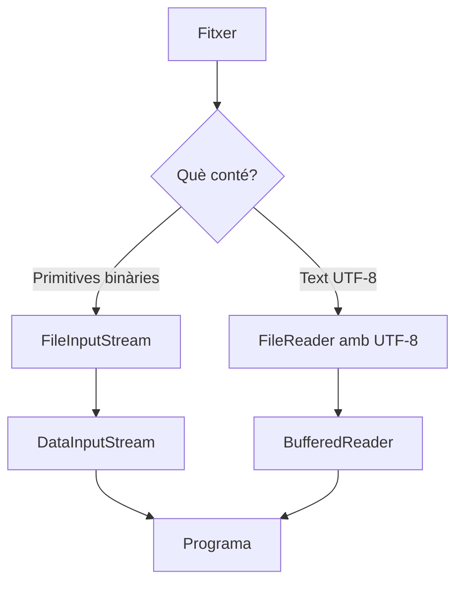

# Fluxos de dades (Streams) en Java

## Què és un flux?

Un **flux** (*stream*) és el camí pel qual les dades entren o ixen d’un programa.

- **Entrada:** el programa llig dades d’un fitxer.
- **Eixida:** el programa escriu dades en un fitxer.

Abans de triar una classe, hem de respondre **dues preguntes**: el contingut és text o binari? Volem llegir-lo o escriure’l?

| Vull… | Classe de partida | Si, a més, necessite… |
|---|---|---|
| Llegir bytes d’un fitxer | `FileInputStream` | Moltes lectures menudes → `BufferedInputStream` |
| Escriure bytes en un fitxer | `FileOutputStream` | Moltes escriptures menudes → `BufferedOutputStream` |
| Llegir dades primitives en binari | `FileInputStream` | `readInt()`, `readDouble()`… → `DataInputStream` |
| Escriure dades primitives en binari | `FileOutputStream` | `writeInt()`, `writeDouble()`… → `DataOutputStream` |
| Llegir text d’un fitxer | `FileReader` | Llegir línies → `BufferedReader` |
| Escriure text en un fitxer | `FileWriter` | Separar línies → `BufferedWriter`; donar format → `PrintWriter` |


Hi ha, per tant, **dues famílies**:

- Els fluxos de **bytes** treballen amb les dades binàries sense interpretar-les com a text: `InputStream` i `OutputStream`.
- Els fluxos de **caràcters** treballen amb text: `Reader` i `Writer`.

**Un fitxer de text també està format per bytes.** Per a obtindre els caràcters, Java ha d’interpretar eixos bytes amb una codificació, com ara **UTF-8**. En els exemples de fitxers de text indicarem `StandardCharsets.UTF_8`.

> Els exemples són fragments que podem posar dins d’un mètode que declare `throws IOException`. Suposem els imports `java.io.*` i `java.nio.charset.StandardCharsets`. Quan necessitem gestionar l’error en el mateix lloc, utilitzarem `catch`.

## Obrir i tancar els fluxos

Els fluxos s’han de tancar quan acabem d’usar-los. La forma habitual és **`try-with-resources`**:

```java
try (FileInputStream fis = new FileInputStream("logo.png")) {
    // Ací llegirem el fitxer.
} // Java tanca fis automàticament.
```

El flux es tanca en eixir del `try`, **també si es produeix una excepció**. Si un flux està embolicat dins d’un altre, tancar el de fora tanca també els que té dins.

Les excepcions més habituals són:

| Excepció | Significat |
|---|---|
| `FileNotFoundException` | No s’ha pogut obrir el fitxer. |
| `IOException` | S’ha produït un problema de lectura o escriptura. |
| `EOFException` | Hem intentat llegir una dada completa quan ja no quedaven prou bytes. Pot passar amb `DataInputStream`. |

Podem capturar una `IOException` amb `catch` o deixar que el mètode la propague amb `throws IOException`.

> Si usem una **ruta relativa**, com `"logo.png"`, Java buscarà el fitxer a partir del directori de treball del programa. Crear un objecte `File` amb eixa ruta, com hem vist en el tema anterior, tampoc crea el fitxer físicament.

---

# Fluxos de bytes

Els utilitzarem per a imatges, vídeos, PDF i qualsevol dada que vulguem tractar com a bytes. També podem guardar nombres i altres valors en binari amb `DataOutputStream` i llegir-los amb `DataInputStream`.

## `FileInputStream`: llegir bytes

Obri un fitxer per a lectura binària:

```java
new FileInputStream("logo.png")
```

També podem passar-li un objecte `File` en lloc de la ruta.

**Mètodes principals:**

- `int read()`: llig un byte i retorna un valor de `0` a `255`. Retorna `-1` quan arriba al final.
- `int read(byte[] bloc)`: llig diversos bytes i retorna **quants n’ha llegit**. Retorna `-1` al final.
- `void close()`: tanca el flux.

**Exemple: llegir i mostrar tots els bytes.**

```java
try (FileInputStream fis = new FileInputStream("logo.png")) {
    int b;

    while ((b = fis.read()) != -1) { // llegim byte a byte
        System.out.println(b);       // mostrem el valor
    }
}
```

La variable `b` és un `int` perquè `read()` ha de poder retornar tant els valors dels bytes (`0–255`) com el valor especial `-1`. El `while` continua fins que s’ha llegit **tot el fitxer**.

## `FileOutputStream`: escriure bytes

Crea un fitxer per a escriptura binària. Si ja existia, **en substitueix el contingut**:

```java
new FileOutputStream("dades.bin")
```

Per a afegir bytes al final d’un fitxer existent:

```java
new FileOutputStream("dades.bin", true)
```

**Mètodes principals:**

- `void write(int b)`: escriu un byte; utilitza els 8 bits menys significatius de l’enter.
- `void write(byte[] bloc)`: escriu tot l’array.
- `void write(byte[] bloc, int inici, int longitud)`: escriu només la part indicada de l’array.

**Exemple:**

```java
try (FileOutputStream fos = new FileOutputStream("dades.bin")) {
    fos.write(new byte[] {10, 20, 30}); // escrivim tres bytes
}
```

El fitxer resultant conté **tres bytes**, no els caràcters del text `"10, 20, 30"`.

## `BufferedInputStream` i `BufferedOutputStream`: usar un buffer

Estes classes **emboliquen** un flux de bytes i hi afegixen un buffer.

- `BufferedInputStream` agrupa lectures.
- `BufferedOutputStream` agrupa escriptures.

Són útils, sobretot, quan fem moltes operacions menudes. **No són obligatòries simplement perquè un fitxer siga gran.**

Els seus mètodes de lectura i escriptura s’usen igual que els de `FileInputStream` i `FileOutputStream`. `BufferedOutputStream` també té `void flush()`, que envia les dades pendents del buffer sense tancar el flux.

**Exemple: copiar una imatge en blocs.**

```java
try (BufferedInputStream entrada = new BufferedInputStream(
         new FileInputStream("foto.png"));
     BufferedOutputStream eixida = new BufferedOutputStream(
         new FileOutputStream("copia.png"))) {

    byte[] bloc = new byte[4096];
    int llegits;

    while ((llegits = entrada.read(bloc)) != -1) {
        eixida.write(bloc, 0, llegits); // escrivim només els bytes llegits
    }
}
```

**Què fa cada part?**

1. `FileInputStream` obri la imatge original; `FileOutputStream` crea la còpia.
2. Els dos fluxos `Buffered…` afegixen buffers.
3. `entrada.read(bloc)` intenta llegir fins a 4096 bytes i retorna el nombre **real** de bytes llegits.
4. `eixida.write(bloc, 0, llegits)` escriu exactament eixos bytes.

L’última lectura pot omplir només una part de l’array. Si escriguérem sempre tot `bloc`, podríem afegir a la còpia bytes que havien quedat de la lectura anterior.

> `flush()` envia les dades pendents a la capa següent del flux. **No garanteix** que el sistema operatiu ja les haja gravades físicament al disc. En tancar un `BufferedOutputStream`, s’envien les dades que queden pendents.

## `DataOutputStream` i `DataInputStream`: guardar dades primitives

Estes classes permeten escriure i llegir en **format binari** valors com `int`, `long` o `double`.

| Escriptura | Lectura corresponent |
|---|---|
| `void writeInt(int valor)` | `int readInt()` |
| `void writeLong(long valor)` | `long readLong()` |
| `void writeDouble(double valor)` | `double readDouble()` |
| `void writeUTF(String text)` | `String readUTF()` |

També disposen de mètodes per a `boolean`, `byte`, `short`, `char` i `float`.

**Primer, escrivim dos alumnes:**

```java
try (DataOutputStream dos = new DataOutputStream(
         new BufferedOutputStream(new FileOutputStream("notes.dat")))) {

    dos.writeInt(2);          // nombre d'alumnes

    dos.writeLong(1L);        // alumna 1: identificador
    dos.writeUTF("Anna");     // alumna 1: nom
    dos.writeDouble(9.5);    // alumna 1: nota

    dos.writeLong(2L);        // alumne 2: identificador
    dos.writeUTF("Marc");     // alumne 2: nom
    dos.writeDouble(7.8);    // alumne 2: nota
}
```

**Després, llegim el mateix fitxer:**

```java
try (DataInputStream dis = new DataInputStream(
         new BufferedInputStream(new FileInputStream("notes.dat")))) {

    int quantitat = dis.readInt(); // recuperem el nombre d'alumnes

    for (int i = 0; i < quantitat; i++) {
        long id = dis.readLong();       // mateix ordre que en escriure
        String nom = dis.readUTF();
        double nota = dis.readDouble();

        System.out.printf("%d %s %.2f%n", id, nom, nota);
    }
}
```

**La regla més important és respectar l’ordre i el tipus de cada camp.** Hem escrit `long → String → double` per a cada alumne; els llegim exactament igual. El fitxer `notes.dat` no és un fitxer de text que puguem llegir correctament amb `BufferedReader`.

`writeUTF()` i `readUTF()` utilitzen el format de cadenes propi d’estos mètodes (*Modified UTF-8*). **No equival a escriure i llegir un `.txt` UTF-8 corrent.**

---

# Fluxos de caràcters

Els utilitzarem per a fitxers de **text**, com `.txt` o `.csv`. Els noms base són `Reader` per a llegir i `Writer` per a escriure.

En Java, un `char` és una unitat de codi UTF-16. Per a interpretar els bytes d’un fitxer de text, indicarem la codificació amb què s’ha guardat. En els exemples: `StandardCharsets.UTF_8`.

## `FileReader` i `FileWriter`: accés directe a un fitxer de text

`FileReader` llig caràcters d’un fitxer:

```java
new FileReader("poema.txt", StandardCharsets.UTF_8)
```

`FileWriter` hi escriu caràcters:

```java
new FileWriter("nota.txt", StandardCharsets.UTF_8)
```

**Mètodes principals:**

- `int read()`: llig un `char` i retorna `-1` al final.
- `int read(char[] bloc)`: llig diversos caràcters i retorna quants n’ha llegit.
- `void write(String text)`: escriu text **sense afegir un salt de línia**.
- `void close()`: tanca el flux.

Els constructors sense `Charset` utilitzen la codificació predeterminada de l’entorn. En versions actuals de Java podem indicar UTF-8 directament a `FileReader` i `FileWriter`; **no cal construir sempre un pont de bytes a caràcters**.

**Exemple: escriure una nota de text.**

```java
try (FileWriter fw =
         new FileWriter("nota.txt", StandardCharsets.UTF_8)) {

    fw.write("Hola món"); // escrivim text en UTF-8
}
```

El constructor anterior crea o **sobreescriu** `nota.txt`. Si volem afegir una anotació al final, utilitzem el constructor amb `append`:

```java
try (FileWriter fw =
         new FileWriter("nota.txt", StandardCharsets.UTF_8, true)) {

    fw.write(System.lineSeparator()); // separem l'anotació anterior
    fw.write("Nova anotació");         // afegim text al final
}
```

## `BufferedReader` i `BufferedWriter`: treballar amb línies

`BufferedReader` embolica un `Reader` i afegeix `String readLine()`. Este mètode:

- Retorna el text d’una línia **sense el salt de línia**.
- Retorna `null` quan ja no queden línies.

`BufferedWriter` embolica un `Writer` i aporta `void newLine()` per a escriure un salt de línia. Les dues classes també afegixen un buffer.

**Exemple: llegir un fitxer de text i escriure’n una còpia.**

```java
try (BufferedReader br = new BufferedReader(
         new FileReader("entrada.txt", StandardCharsets.UTF_8));
     BufferedWriter bw = new BufferedWriter(
         new FileWriter("copia.txt", StandardCharsets.UTF_8))) {

    String linia;

    while ((linia = br.readLine()) != null) {
        bw.write(linia); // escrivim el text de la línia
        bw.newLine();     // recuperem el salt de línia
    }
}
```

**Què hem de recordar?**

1. `FileReader` i `FileWriter` obrin els fitxers de text.
2. `BufferedReader` permet llegir línies; `BufferedWriter` permet escriure-les.
3. Com que `readLine()` elimina el salt de línia, cridem `newLine()` després d’escriure cada línia.
4. Comprovem `null`, **no `-1`**, perquè `readLine()` retorna una `String`.

Esta còpia conserva el **text de les línies**, però pot canviar els salts de línia originals pels del sistema on s’executa el programa. Si necessitem una còpia exacta byte a byte, utilitzarem fluxos de bytes.

## `InputStreamReader` i `OutputStreamWriter`: el pont entre bytes i text

De vegades ja tenim un flux de bytes i volem tractar les seues dades com a text. Per a això hi ha dues classes pont:

| Classe | Conversió | Quan la necessitem? |
|---|---|---|
| `InputStreamReader` | Bytes → caràcters | Quan ja tenim un `InputStream` del qual volem llegir text. |
| `OutputStreamWriter` | Caràcters → bytes | Quan ja tenim un `OutputStream` en què volem escriure text. |

**Exemple d’entrada:** `InputStreamReader` transforma els bytes de `System.in` en caràcters perquè `BufferedReader` puga llegir una línia.

```java
BufferedReader br =
    new BufferedReader(new InputStreamReader(System.in));

System.out.print("Introdueix el teu nom: ");
String nom = br.readLine(); // llegim una línia de la consola
System.out.println("Hola " + nom);
```

En este exemple la codificació depén de l’entorn de la consola. En un programa senzill no solem tancar `System.in`, perquè això impediria continuar llegint-ne dades.

**Exemple d’eixida:** `OutputStreamWriter` rep text i l’escriu en un flux de bytes amb UTF-8.

```java
try (OutputStreamWriter osw = new OutputStreamWriter(
         new FileOutputStream("resum.txt"),
         StandardCharsets.UTF_8)) {

    osw.write("Informació de València"); // caràcters → bytes UTF-8
}
```

Per a escriure directament en un fitxer, `FileWriter` amb UTF-8 és més curt. El pont resulta especialment útil quan **la destinació ja és un `OutputStream`**.

## `PrintWriter`: escriure text amb format

`PrintWriter` aporta mètodes còmodes per a generar text:

- `void print(String text)`: escriu sense salt de línia.
- `void println(String text)`: escriu i acaba la línia.
- `PrintWriter printf(String format, Object... valors)`: escriu amb format.
- `boolean checkError()`: indica si s’ha detectat un error d’escriptura.

**Exemple: crear un informe.**

```java
try (PrintWriter pw = new PrintWriter(
         new FileWriter("informe.txt", StandardCharsets.UTF_8))) {

    pw.println("ID\tNom\tNota");                 // capçalera
    pw.printf("%d\t%s\t%.2f%n", 1, "Anna", 9.25); // alumna 1
    pw.printf("%d\t%s\t%.2f%n", 2, "Marc", 7.80); // alumne 2

    if (pw.checkError()) {
        System.err.println("Error en escriure l'informe");
    }
}
```

`\t` és un tabulador, `%.2f` mostra dos decimals i `%n` acaba la línia.

**Atenció:** `PrintWriter` no sol comunicar els errors dels seus mètodes d’escriptura llançant una `IOException`. Si necessitem comprovar-los, utilitzem `checkError()`.

---

# Com es combinen les classes?

Algunes classes **obrin el fitxer**; altres **reben un flux i li afegixen una funció**.

```java
new BufferedReader(
    new FileReader("entrada.txt", StandardCharsets.UTF_8)
)
```

`FileReader` indica **d’on es llig el text**. `BufferedReader` afegeix **buffer i lectura de línies**. Esta manera d’embolcallar un objecte amb un altre per ampliar-ne el comportament és la idea del **patró Decorator**.

La taula inicial ens ajuda a triar les classes. Este gràfic mostra **com s’encaixen** en dues situacions diferents:


```mermaid
flowchart TD
    A["Fitxer"] --> B{"Què conté?"}
    B -->|"Primitives binàries"| C["FileInputStream"]
    C --> D["DataInputStream"]
    B -->|"Text UTF-8"| E["FileReader amb UTF-8"]
    E --> F["BufferedReader"]
    D --> G["Programa"]
    F --> G
```

Podem intercalar `BufferedInputStream` abans de `DataInputStream` quan ens interesse afegir un buffer. En canvi, per a llegir línies de text necessitem `BufferedReader`, que treballa amb un `Reader`.

**Tanquem la capa exterior** amb `try-with-resources` i es tanquen també les capes interiors. Afegim cada capa perquè necessitem la funció que aporta, no perquè totes hagen d’aparéixer sempre.

## Per a recordar

- `InputStream` i `OutputStream` → **bytes**.
- `Reader` i `Writer` → **text**.
- `File…` → obri el fitxer.
- `Buffered…` → afegeix un buffer; `BufferedReader` llig línies i `BufferedWriter` les separa.
- `DataInputStream` i `DataOutputStream` → valors **binaris**; cal respectar tipus i ordre.
- `InputStreamReader` i `OutputStreamWriter` → pont entre bytes i caràcters.
- `PrintWriter` → text amb `print()`, `println()` i `printf()`.
- `try-with-resources` → tancament automàtic.

## Mètodes addicionals per a consultar

Estos mètodes existeixen, però **no els necessitem per a les lectures i escriptures habituals** explicades abans.

| Mètode | Per a què serveix? |
|---|---|
| `int read(byte[] bloc, int inici, int longitud)` | Llig bytes en una part concreta de l’array. |
| `int read(char[] bloc, int inici, int longitud)` | Fa el mateix amb caràcters. |
| `long skip(long n)` | Intenta avançar `n` bytes sense processar-los; retorna quants n’ha saltat. |
| `int available()` | Indica quants bytes es poden llegir sense bloquejar; no és una forma general de saber la mida del fitxer. |
| `void mark(int limit)` i `void reset()` | Marquen una posició i permeten tornar-hi si el flux ho admet i la marca continua sent vàlida. |
| `boolean markSupported()` | Indica si el flux admet `mark()` i `reset()`. |
| `boolean ready()` | Indica si la pròxima lectura de caràcters es pot fer sense bloquejar. |
| `String getEncoding()` | Retorna el nom de la codificació usada per `InputStreamReader` o `OutputStreamWriter`. |

`BufferedInputStream` i `BufferedReader` admeten `mark()` i `reset()`. En canvi, no hem de suposar que qualsevol flux ho permeta: podem comprovar-ho amb `markSupported()`.