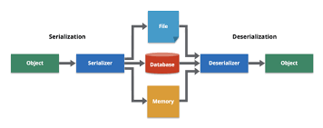

# Serialització – Transferint Objectes

La serialització és el procés de convertir la informació ***d’estat d’una instància d’objecte*** en una forma **binària o textual** per persistir en un medi d’emmagatzematge o transportat per una xarxa.

És a dir, **Serialitzar** és convertir un objecte en una successió de bytes, amb l’objectiu de guardar-lo o enviar-lo per xarxa per a posteriorment reconstruir-lo.

La **Deserialització** seria el procés invers, tornar a reconstruir l’objecte a partir d’un flux de bytes.    

El flux de bytes creat és independent de la plataforma. Per tant, l'objecte serialitzat en una plataforma es pot deserialitzar en una plataforma diferent.

{: .text-center }



## Avantatges de la serialització:

- Per desar/conservar l'estat d'un objecte.
- Viatjar un objecte a través d’una xarxa.
- Per a la comunicació entre processos. Com per exemple, en la comunicació entre un servidor i un client.
- Per a la persistència de dades.
- Per a la clonació d'objectes, amb l'objectiu de crear una còpia exacta d'un objecte per a ser utilitzat en un altre context.
  

## Inconvenients:

- Malauradament, el procés de serialització segueix **unes configuracions específiques de Java**, i **no serveix** per intercanviar dades amb programes escrits en **altres llenguatge**s.
- Els canvis en el codi dels objectes poden fer que no es puga recuperar un objecte d’una versió anterior serialitzat.
- La serialització pot ser lenta i ineficient en termes de memòria, ja que es guarden tots els atributs de l'objecte, incloent els que no són necessaris.


## Quines classes utilitzem en Java per a Serialitzar-Deserialitzar?


| Aspecte                       | Descripció                                                         |
|-------------------------------|---------------------------------------------------------------------|
| Objecte Serialitzable          | Interfície `Serializable`.                                          |
| Per a Serialitzar              | `ObjectOutputStream`<br>`writeObject()`                             |
| Per a Deserialitzar            | `ObjectInputStream`<br>`readObject()`                               |


### Objecte Serialitzable: 
- **Interfície java.io.Serializable:** Els objectes a serialitzar han d’implementar la interfície `java.io.Serializable`. És una interfície sense mètodes, que només serveix com a marcador. Tots els tipus bàsics la implementen implícitament, i també la classe String i els contenidors i objectes Array.

### Per a serialitzar:
- **ObjectOutputStream**
  - `writeObject()`. Este mètode serialitza un objecte i el guarda en un fitxer.

### Per a deserialitzar:
- **ObjectInputStream** 
  - `readObject()`. Este mètode deserialitza un objecte i el carrega en memòria.


### Excepcions durant la serialització:
- **NotSerializableException:** Quan un objecte no implementa `java.io.Serializable.`
- **InvalidClassException:** Quan hi ha problemes amb la classe a serialitzar.
- **IOException:** Qualsevol error que es puga produir en el stream.

### Excepcions durant la deserialització:
- **InvalidClassException:** Quan hi ha problemes amb la classe a deserialitzar.
- **ClassCastException:** La classe deserialitzada no es correspon amb la classe que es vol deserialitzar, es a dir, no coincideixen els noms de les classes o els atributs o els tipus.
- **ClassNotFoundException:** No existeix codi compilat per la classe que s’està deserialitzant.
- **IOException:** Qualsevol error que es pugui produir en el stream.

## Modificador de camp ***transient***


En Java, el modificador de camp `transient` s'utilitza per evitar que certs camps d'una classe es serialitzen. És a dir, quan un objecte és serialitzat (per exemple, emmagatzemat en un fitxer o enviat per la xarxa), els camps marcats com `transient` no seran inclosos en aquest procés. Aquesta característica és útil per camps que són temporals, calculables o que no necessiten ser persistits.

- Quan definim un camp **transient**, indiquem que, en cas de serialitzar l'objecte, el camp definit com ***transient, el seu valor no es serialitzarà***, i en la ***deserialització prendran el valor per defecte***.
  
- Tampoc es serialitzen els camps **static**

### Exemple:

Imagina una classe `Usuari` que té informació sobre un usuari, incloent una contrasenya. No té sentit serialitzar la contrasenya perquè és informació sensible que no hauria de ser desada en el mateix format que altres dades.

```java

import java.io.Serializable;

public class Usuari implements Serializable {
    private String nom;
    private transient String contrasenya;  // No es serialitzarà

    public Usuari(String nom, String contrasenya) {
        this.nom = nom;
        this.contrasenya = contrasenya;
    }

    @Override
    public String toString() {
        return "Nom: " + nom + ", Contrasenya: " + contrasenya;
    }
}
```

En aquest exemple:
- La variable `nom` es serialitzarà normalment.
- La variable `contrasenya` està marcada com a `transient`, de manera que no es desarà quan es serialitzi l'objecte.

### Serialització de l'objecte

Quan serialitzem un objecte d'aquesta classe, només el camp `nom` serà inclòs. La contrasenya es "perd" perquè està marcada com a `transient`.

```java

import java.io.*;

public class ExempleSerialitzacio {
    public static void main(String[] args) {
        Usuari usuari = new Usuari("Joan", "superSecret123");

        try (ObjectOutputStream oos = new ObjectOutputStream(new FileOutputStream("usuari.dat"))) {
            oos.writeObject(usuari);
        } catch (IOException e) {
            e.printStackTrace();
        }

        // Ara llegim l'objecte des del fitxer
        try (ObjectInputStream ois = new ObjectInputStream(new FileInputStream("usuari.dat"))) {
            Usuari deserialitzat = (Usuari) ois.readObject();
            System.out.println(deserialitzat);  // La contrasenya serà null
        } catch (IOException | ClassNotFoundException e) {
            e.printStackTrace();
        }
    }
}
```

### Resultat:

Quan llegeixis l'objecte des del fitxer, veuràs que el camp `contrasenya` és `null`, perquè no es va serialitzar:

```
Nom: Joan, Contrasenya: null
```

En definitiva, el modificador `transient` s'utilitza per evitar la serialització de camps que no són necessaris o que són sensibles, com les contrasenyes. És una eina útil per optimitzar la serialització i protegir la privacitat de les dades.

---


## Exemples de serialització

### **1. Objecte Serialitzable**

```java

public class Employee implements java.io.Serializable {
    public String name;
    public String address;
    public transient int SSN;

    // El camp transient, que no se serialitzarà, no podrem recuperar el valor en la deserialització.
    public int number; 
}

```

###  **2. Serialització**

Volem guardar un objecte de la classe `Employee` en un fitxer anomenat `employee.ser`.

```java

import java.io.*;

public class SerializeDemo {  
    public static void main(String[] args) { 

        // Crea un objecte Employee
        Employee e = new Employee(); 
        e.name = "Reyan Ali"; 
        e.address = "Phokka Kuan, Ambehta Peer"; 
        e.SSN = 11122333; 
        e.number = 101; 

        // El serialitza
        try (FileOutputStream fileOut = new FileOutputStream("employee.ser");
             ObjectOutputStream out = new ObjectOutputStream(fileOut)) { 
            out.writeObject(e); 
            System.out.printf("Serialized data is saved in employee.ser"); 
        } catch (IOException i) { 
            i.printStackTrace(); 
        } 
    }
}

```

### **3. Deserialització**

Volem llegir l'objecte `Employee` des del fitxer `employee.ser`.

```java

import java.io.*;

public class DeserializeDemo { 

    public static void main(String[] args) { 
        Employee e = null; 
        // Deserialitza un objecte Employee

        try (FileInputStream fileIn = new FileInputStream("employee.ser");
             ObjectInputStream in = new ObjectInputStream(fileIn)) { 
            e = (Employee) in.readObject(); 
        } catch (IOException i) { 
            i.printStackTrace(); 
        } catch (ClassNotFoundException c) { 
            System.out.println("Employee class not found"); 
            c.printStackTrace(); 
        } 

        // El mostra a pantalla
        System.out.println("Deserialized Employee...");
        System.out.println("Name: " + e.name);
        System.out.println("Address: " + e.address);
        System.out.println("SSN: " + e.SSN);
        System.out.println("Number: " + e.number); 
    }
}


```


L'eixida per pantalla seria:
```

Serialized data is saved in employee.ser
Deserialized Employee...
Name: Reyan Ali
Address: Phokka Kuan, Ambehta Peer
SSN: 0
Number: 101
```


---

## En resum...

1. Si una classe principal ha implementat una interfície serialitzable, la classe secundària no necessita implementar-la, però viceversa no és certa.
2. Només els membres de dades no estàtiques es guarden mitjançant el procés de serialització.
3. Els membres de dades estàtiques i els membres de dades transitories no es guarden mitjançant el procés de serialització.
4. No es crida mai el constructor d'objecte quan es deserialitza un objecte.
5. Els objectes associats han d'implementar una interfície serialitzable.

---

## Exemple 2

```java

import java.io.*;

class Demo implements java.io.Serializable {

    public int a;
    public String b;

    // Constructor per defecte
    public Demo(int a, String b) { 
        this.a = a; 
        this.b = b; 
    }
}

class Exemple2 {

    public static void main(String[] args){  

        Demo object = new Demo(1, "Hola xics, bon dia"); 
        String filename = "fitxer.ser"; 

        // Serialització

        try {    
            FileOutputStream file = new FileOutputStream(filename); 
            ObjectOutputStream out = new ObjectOutputStream(file); 
            out.writeObject(object); 

            out.close(); 
            file.close(); 

            System.out.println("L'Objecte ha segut serialitzat"); 

        } catch(IOException ex) { 
            System.out.println("S'ha produït una IOException"); 
        }

        Demo object1 = null;

        // Deserialització

        try {    
            FileInputStream file = new FileInputStream(filename); 
            ObjectInputStream in = new ObjectInputStream(file); 
            object1 = (Demo) in.readObject(); 

            in.close(); 
            file.close(); 

            System.out.println("L'Objecte ha segut deserialitzat "); 
            System.out.println("a = " + object1.a); 
            System.out.println("b = " + object1.b); 

        } catch(IOException ex) { 
            System.out.println("S'ha produït una IOException"); 
        } catch(ClassNotFoundException ex) { 
            System.out.println("S'ha produït una ClassNotFoundException"); 
        } 
    }
}

```
L'eixida per pantalla seria:

```

L'Objecte ha segut serialitzat
L'Objecte ha segut deserialitzat
a = 1
b = Hola xics, bon dia
```
---

## Exemple 3

```java

import java.io.*;

class Emp implements Serializable {

    private static final long serialversionUID = 129348938L;
    transient int a;
    static int b;
    String name;
    int age;

    // Constructor per defecte
    public Emp(String name, int age, int a, int b) {
        this.name = name;
        this.age = age;
        this.a = a;
        this.b = b;
    }
}

public class Exemple3 {

    public static void printdata(Emp object1) {
        System.out.println("name = " + object1.name);
        System.out.println("age = " + object1.age);
        System.out.println("a = " + object1.a);
        System.out.println("b = " + object1.b);
    }

    public static void main(String[] args) {

        Emp object = new Emp("ab", 20, 2, 1000);
        String filename = "exemple3.txt";

        // Serialització
        try {
            // Guardant un objecte en un File
            FileOutputStream file = new FileOutputStream(filename);
            ObjectOutputStream out = new ObjectOutputStream(file);

            // Mètode per Serialitzar un Objecte
            out.writeObject(object);
            out.close();
            file.close();

            System.out.println("L'objecte ha sigut Serialitzat\n"
                    + "Dades abans de la Deserialitzacio.");
            printdata(object);

            // Valor de la variable estàtica canviat
            object.b = 2000;

        } catch (IOException ex) {
            System.out.println("S'ha produït una IOException");
        }

        // Deserialització
        try {
            // Llegint l'objecte des del fitxer
            FileInputStream file = new FileInputStream(filename);
            ObjectInputStream in = new ObjectInputStream(file);

            // Mètode per deserialitzar un objecte
            object = (Emp) in.readObject();
            in.close();
            file.close();

            System.out.println("L'objecte ha sigut Deserialitzat\n"
                    + "Dades despres de la Deserialitzacio.");
            printdata(object);

        } catch (IOException ex) {
            System.out.println("S'ha produït una IOException");
        } catch (ClassNotFoundException ex) {
            System.out.println("S'ha produït una ClassNotFoundException");
        }
    }
}
```
L'eixida per pantalla seria:

```

L'objecte ha sigut Serialitzat
Dades abans de la Deserialitzacio.
name = ab
age = 20
a = 2
b = 1000

L'objecte ha sigut Deserialitzat
Dades despres de la Deserialitzacio.
name = ab
age = 20
a = 0
b = 2000

```


### Descripció per a la sortida:

S’ha vist en deserialitzar l'objecte que els valors de `a` i `b` han canviat. La raó es deu al fet que `a` es va marcar com a **transitòria** i `b` com a **estàtica**.

- **En cas de variables transitòries**: Una variable definida amb la paraula clau **transient** no es serialitza durant el procés de serialització. Aquesta variable s'inicialitzarà amb el valor predeterminat durant la deserialització. (Per exemple: per a objectes és `null`, per a `int` és `0`).

- **En cas de variables estàtiques**: Una variable definida amb la paraula clau **static** no es serialitza durant el procés de serialització. Aquesta variable es carregarà amb el valor actual definit a la classe durant la deserialització.


<! --
## serialVersionUID

El **`serialVersionUID`** és un camp estàtic que s'utilitza durant la **serialització** i **deserialització** d'objectes en Java per assegurar que la versió de la classe que està deserialitzant l'objecte sigui compatible amb la versió que es va utilitzar per serialitzar-lo. Si les versions no coincideixen, es llançarà una excepció de tipus **`InvalidClassException`**.


- **`serialVersionUID`**: És un identificador de versió únic per a una classe serialitzable. Este identificador assegura que l'objecte deserialitzat és compatible amb la classe en què es deserialitza.

---


