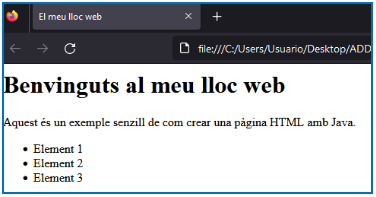

# Fitxers HTML – Lectura i Escriptura

### **Què classes podem utilitzar a java per llegir/escriure un fitxer HTML?**

Els fitxers HTML són simplement fitxers de text, per tant podem utilitzar totes les classes (amb els seus mètodes) vistos fins ara, recordem els més comuns:

| Lectura de Fitxers                              | Escriptura de Fitxers                           |
|-------------------------------------------------|-------------------------------------------------|
| **FileInputStream**: S'utilitza per llegir bytes d'un fitxer.  | **FileOutputStream**: S'utilitza per escriure bytes en un fitxer. |
| **FileReader**: Per llegir caràcters d'un fitxer de text. | **FileWriter**: Per escriure caràcters en un fitxer de text. |
| **BufferedReader**: Per llegir caràcters de manera més eficient, especialment quan es llegeixen línies senceres. | **BufferedWriter**: Per escriure caràcters de manera més eficient, especialment quan s'escriuen línies senceres. |
| **Scanner**: Per llegir dades formatejades a partir d'un fitxer o una entrada d'usuari. | **PrintWriter**: S'utilitza per escriure caràcters o representacions de tipus de dades en un fitxer. |

**Manipulació de Fitxers: Serialització d'Objectes:**  
  


| Manipulació de Fitxers                          | Serialització d'Objectes                        |
|-------------------------------------------------|-------------------------------------------------|
| **File**: S'utilitza per obtenir informació sobre fitxers, com ara la seva existència, mida, rutes, etc. | **ObjectInputStream**: S'utilitza per llegir objectes serialitzats des d'un flux d'entrada. |
| **Files** (a partir de Java 7): proporciona mètodes estàtics per a diverses operacions de manipulació de fitxers, com la còpia, moviment, eliminació, llegida/escriptura de fitxers, entre d'altres. | **ObjectOutputStream**: S'utilitza per escriure objectes serialitzats a un flux de sortida. |

### Exemple Lectura:

```java
import java.io.BufferedReader;
import java.io.FileReader;
import java.io.IOException;

public class ReadHTMLFile {
    public static void main(String[] args) {
        try (FileReader fileReader = new FileReader("arxiu.html");
             BufferedReader bufferedReader = new BufferedReader(fileReader)) {
            String line;
            while ((line = bufferedReader.readLine()) != null) {
                System.out.println(line);
            }
        } catch (IOException e) {
            e.printStackTrace();
        }
    }
}
```

---

### Exemple Escriptura:

```java
import java.io.*;

public class WriteHTMLFile {
    public static void main(String[] args) {
        try (PrintWriter writer = new PrintWriter("arxiu.html", "UTF-8")) {
            writer.println("<html>");
            writer.println("<head>");
            writer.println("<title>El meu fitxer HTML</title>");
            writer.println("</head>");
            writer.println("<body>");
            writer.println("<h1>Hola, món!</h1>");
            writer.println("</body>");
            writer.println("</html>");
        } catch (IOException e) {
            e.printStackTrace();
        }
    }
}
```

Nota: Amb FileWriter i BufferedWriter seria:

```java
bufferWriter.write("<html>");
bufferWriter.newLine();
bufferWriter.write("<head>");
bufferWriter.newLine();
```

---

Llegir fitxers HTML des de Java pot ser útil en diverses situacions, com:

- **Processament de dades**: Si tens un arxiu HTML estructurat que conté informació rellevant, pots llegir-lo des de Java per a extraure i processar eixes dades.  
  Per exemple, si tens un arxiu HTML que conté una taula de dades, pots llegir l'arxiu per a extraure els valors de la taula i realitzar càlculs o anàlisis sobre ells.

- **Web Scraping**: És el procés d'extracció d'informació de llocs web. Al llegir fitxers en HTML podem analitzar l'estructura de l'arxiu i extraure dades específiques, com a text, imatges, enllaços, etc. Això és especialment útil si necessites automatitzar l'extracció de dades de múltiples pàgines web.

- **Generació dinàmica de contingut**: Si tens una plantilla HTML predefinida i desitges generar contingut dinàmic, pots llegir l'arxiu HTML des de Java i reemplaçar unes certes parts amb dades específiques. Això pot ser útil per a generar informes, documents personalitzats, correus electrònics, entre altres.

- **Anàlisi de contingut web**: Llegir fitxers HTML des de Java ens permet analitzar i processar el contingut d'una pàgina web, ja siga per a extraure informació rellevant, realitzar anàlisi de SEO (Search Engine Optimization), validar l'estructura i etiquetatge correcte, entre altres.

---


## Exercicis Fitxers HTML

### 1.- Crear HTML.

Crea un programa en Java que sol·licite a l'usuari les següents dades:

- Títol de la pàgina.
- Títol principal de la pàgina.
- Contingut del paràgraf.
- Tres elements per a una llista no ordenada (ul).

Usa `FileWriter` i `BufferedWriter` i utilitza estes dades per generar un arxiu `index.html` amb la següent estructura:

```html

<html>
  <head>
    <!-- Insereix el títol proporcionat per l'usuari ací -->
  </head>
  <body>

    <!-- Insereix el títol principal proporcionat per l'usuari ací -->
    <!-- Insereix el contingut del paràgraf proporcionat per l'usuari ací -->

    <ul>
      <!-- Insereix els tres elements de la llista proporcionats ací -->
    </ul>

  </body>
</html>

```
---





---


### 2.- Crear HTML amb UTF-8.

Modifica l'exercici anterior afegint la codificació UTF-8 per a l'arxiu de sortida. Això es fa utilitzant `OutputStreamWriter` amb la codificació UTF-8. Utilitza també un buffer intermig.

Nota:
```java
OutputStreamWriter outputStreamWriter = new OutputStreamWriter(fileOutputStream, "UTF-8");
```

---

### 3.- Processar un arxiu HTML.

Escriu un programa en Java que llegeix un arxiu HTML anomenat `index.HTML` i troba la suma de tots els números presents en l'arxiu. L'arxiu HTML serà el generat de l'exercici anterior.

Nota:
- Cal usar `Pattern` i `Matcher`.
- Pots concatenar primer tot l'arxiu en un String i aplicar el patró o llegir directament de l'arxiu línia a línia i aplicar el patró a cada línia que vas llegint.

---

### 4.- Web Scraping.

Crea un programa de web scraping que obtinga informació d'una pàgina web. El programa ha de realitzar les següents tasques:

- Obtenir el títol de la pàgina i mostrar-lo per pantalla.
- Extreure els enllaços de notícies de la pàgina i mostrar-los per pantalla juntament amb el text associat a cada enllaç.

Podeu utilitzar les següents eines proporcionades:

```java
import java.io.IOException;
import java.net.URL;
import java.util.Scanner;
import java.util.regex.Matcher;
import java.util.regex.Pattern;

URL url = new URL("https://    ");
Scanner scanner = new Scanner(url.openStream());
```

