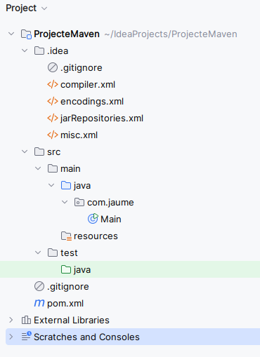

# Jackson - Conceptes Previs

{:toc}

## Introducció

Quan creem aplicacions Java, moltes voltes necessitem convertir objectes en formats de dades que es puguen emmagatzemar, enviar a través de la xarxa o consumir per altres sistemes. Això es coneix com a **serialització** (convertir objectes en formats com JSON o XML) i **deserialització** (convertir formats de dades en objectes Java).

Jackson és una de les llibreries més utilitzades per a aquest propòsit, gràcies a la seva simplicitat, velocitat i versatilitat.

>**Nota:**  Recorda que ja utilitzavem la interfície **Serlializer**  per a serialitzar-deserialitzar objectes Java a un fitxer binari.

Jackson és especialment útil per a interactuar amb serveis web, emmagatzemar dades de manera estructurada i manipular dades de forma eficient en aplicacions Java.

### Què és Jackson?

**Jackson** és una biblioteca de processament de dades per a Java que permet la conversió d'objectes Java a formats de dades com JSON, XML, CSV, i altres. La seva principal eina és la classe **ObjectMapper**, que facilita la **serialització** i **deserialització** de dades amb pocs esforços de configuració. 

Jackson és conegut per:

- La seva capacitat de serialitzar objectes Java en representacions JSON, XML o CSV de manera senzilla.
- La seva capacitat de deserialitzar aquestes representacions en objectes Java, la qual cosa permet treballar amb les dades dins de l'aplicació.
- L'ús d'anotacions, com `@JsonProperty`, `@JsonIgnore` per JSON, o `@JacksonXmlProperty` per XML, que ofereixen un control detallat sobre com es gestionen les propietats durant la conversió.


Jackson suporta diversos formats de dades, com ara:
- **JSON**: JavaScript Object Notation, un format lleuger i fàcil de llegir per a l'intercanvi de dades.
- **XML**: Extensible Markup Language, un format de dades estructurat i extensible.
- **YAML**: YAML Ain't Markup Language, un format de dades llegible per humans.
- **CSV**: Comma-Separated Values, un format de dades tabular.
- **Propietari**: Formats de dades propietaris o personalitzats, es a dir, formats específics de l'aplicació.
- **Altres**: Altres formats de dades específics, com per exemple Smile, CBOR, Avro, etc.

Existeixen alternatives a Jackson com:

- **Gson**: Llibreria de Google per a la conversió d'objectes Java a JSON i viceversa, similar a Jackson.
- **JAXB**: API de Java per a la vinculació de dades XML a objectes Java.
- **Moshi**: Llibreria de Square per a la conversió d'objectes Java a JSON i viceversa.
- **xStream**: Llibreria per a la serialització i deserialització d'objectes Java a XML.
- **fastjson**: Llibreria de serialització i deserialització JSON d'Alibaba.
- **fastxml**: Llibreria de serialització i deserialització XML.


## POJOs i DTOs

En el desenvolupament d'aplicacions Java, és comú utilitzar classes simples per representar dades, conegudes com a **POJOs (Plain Old Java Objects)** o **DTOs (Data Transfer Objects)**. Aquestes classes contenen atributs i mètodes per accedir i manipular les dades, però no tenen lògica de negoci complexa. Aquesta simplicitat facilita la conversió d'objectes Java a formats de dades com JSON, XML, o altres, cosa que és essencial quan es treballa amb processos de **serialització** i **deserialització**.

### Plain Old Java Object (POJO)

Un **POJO** és una classe Java senzilla que segueix unes convencions estàndard. No hereta d'una classe base específica ni implementa cap interfície especial. El seu objectiu és representar dades de manera simple i estructurada.

### Característiques d'un POJO:
- **Simplicitat**: Un POJO és una classe Java simple, generalment sense cap lògica de negoci complicada. No depèn de cap framework específic.
- **Propietats**: Sol tenir camps privats amb els corresponents mètodes *getters* i *setters* per accedir-hi i modificar-los. Aquestes propietats es mantenen encapsulades, cosa que facilita el control de l'accés a les dades.
- **Serialització i Deserialització Fàcil**: Les instàncies d'un POJO es poden serialitzar (convertir a una forma que es pot emmagatzemar o transmetre) i deserialitzar (reconvertir a l'estat original) fàcilment, cosa que les fa útils per a emmagatzemar o transferir dades.

### Per a què s'utilitzen els POJOs?
- **Emmagatzematge de Dades**: S'utilitzen per a representar dades de manera estructurada. Un POJO pot modelar objectes de negoci com un client, un producte o una comanda.
- **Intercanvi de Dades**: Són útils per a l'intercanvi de dades amb altres components del programari, com ara bases de dades, serveis web, fitxers, i altres sistemes.
- **Comunicació entre Capes**: Són útils per a comunicar informació entre les diferents capes d'una aplicació, com ara la capa de presentació i la capa d'accés a dades.

### Exemple POJO:
```java

public class Producte {
    private String nom;
    private double preu;
    private String descripcio;

    public Producte() {} // Constructor buit requerit

    public Producte(String nom, double preu, String descripcio) {
        this.nom = nom;
        this.preu = preu;
        this.descripcio = descripcio;
    }

    public String getNom() { return nom; }
    public void setNom(String nom) { this.nom = nom; }

    public double getPreu() { return preu; }
    public void setPreu(double preu) { this.preu = preu; }

    public String getDescripcio() { return descripcio; }
    public void setDescripcio(String descripcio) { this.descripcio = descripcio; }

    @Override
    public String toString() {
        return "Producte [nom=" + nom + ", preu=" + preu + ", descripcio=" + descripcio + "]";
    }
}

```

## Data Transfer Object (DTO)

Un **DTO** és un tipus específic de POJO que es centra exclusivament en la **transferència de dades** entre diferents **capes d'una aplicació**, sovint en el context de l'arquitectura de capes. Els DTOs són especialment útils quan es vol optimitzar la quantitat de dades transferides i millorar l'eficiència de les comunicacions.

>**Nota:** Entenem per arquitectura de capes a la divisió de l'aplicació en diferents capes o nivells, com ara la capa de presentació, la capa de negoci, la capa d'accés a dades, etc. Cada capa té una responsabilitat específica i es comunica amb altres capes mitjançant la transferència de dades.


## Característiques i objectius del patró DTO:
- **Optimització de la Transferència de Dades**: Emmagatzemen només les dades necessàries per a una operació específica, eliminant informació innecessària. Això redueix la càrrega de la xarxa i millora el rendiment.
- **Desacoblament de Capes**: Utilitzar DTO permet mantenir les capes de l'aplicació desacoblades, de manera que la capa de presentació no necessita conèixer els detalls d'emmagatzematge de la capa de dades i viceversa. Això facilita la modificació i evolució de les capes de manera independent.
- **Mapeig de Dades**: Es fan servir per a mapejar les dades entre l'estructura de dades subjacents i la forma que es requereix per a la comunicació entre capes.
- **Classe Senzilla**: Un DTO és una classe simple amb atributs (generalment amb mètodes getters i setters) que només emmagatzema les dades necessàries. No conté lògica de negoci.

### Exemple DTO:
```java

public class ProducteDTO {
    private String nom;
    private double preu;

    public ProducteDTO() {} // Constructor per defecte

    public ProducteDTO(String nom, double preu) {
        this.nom = nom;
        this.preu = preu;
    }

    public String getNom() { return nom; }
    public void setNom(String nom) { this.nom = nom; }

    public double getPreu() { return preu; }
    public void setPreu(double preu) { this.preu = preu; }
}

```

### Exemple d'ús del patró DTO:
Imagina una aplicació web de comerç electrònic amb una capa de presentació i una capa de servei. La capa de presentació necessita informació sobre productes, com ara noms i preus, per a mostrar-los a la pàgina web. En aquest cas, es podria utilitzar un DTO (`ProducteDTO`) que contingui només aquestes dades essencials, en lloc de transferir totes les propietats detallades dels productes, com ara descripcions, marques i imatges.

L'ús de DTO permet optimitzar la transferència de dades entre la capa de servei i la capa de presentació, ja que només es **transmetrien les dades imprescindibles**. Això pot millorar l'eficiència de la comunicació i reduir la càrrega de la xarxa.

### Diferències entre POJO i DTO

| **POJO** | **DTO** |
|----------|---------|
| Classe Java genèrica amb dades i possibilitat de lògica de negoci. | Classe especialitzada per a la transferència de dades entre capes. |
| Pot contenir atributs, mètodes i lògica addicional. | Conté només atributs per transferir dades i mètodes getters/setters. |
| S'utilitza per emmagatzemar dades i també pot tenir comportaments. | S'utilitza per optimitzar la comunicació entre capes, minimitzant la informació. |
| Exemple: `Producte` amb nom, preu, descripció i altres propietats. | Exemple: `ProducteDTO` amb només nom i preu per a la capa de presentació. |

### En resum

Els **POJOs** són classes Java senzilles que representen objectes de manera estructurada, mentre que els **DTOs** són un tipus específic de POJO centrat en optimitzar la transferència de dades entre capes. Utilitzar POJOs i DTOs facilita la integració amb llibreries de serialització com **Jackson**, ja que simplifica el procés de conversió de dades i assegura que les classes siguin compatibles amb les convencions de Java. Això resulta en un codi més net, fàcil de mantenir i que funciona bé amb la serialització i deserialització de dades.


L'ús de **POJOs** i **DTOs** fa que la integració amb Jackson sigui més fàcil i directa, ja que simplifica el procés de conversió de dades i assegura que les classes siguin compatibles amb les convencions de la llibreria. Això resulta en un codi més net, fàcil de mantenir i que funciona bé amb la serialització i deserialització de dades.


## Anotacions en Java

Les **anotacions** en Java són una forma de proporcionar **metadades** al codi font, que poden ser utilitzades per compiladors, entorns d'execució i eines de desenvolupament. Les anotacions no tenen un efecte directe en la lògica del codi, però poden influir en com es comporta aquest codi quan es compila, s'executa o es genera documentació.

> **Nota:** Les metadades són dades que descriuen altres dades. En aquest cas, les anotacions descriuen les classes, mètodes, camps, etc., del codi font.


Les anotacions són elements que es defineixen amb el símbol `@` seguit del nom de l'anotació. Poden aplicar-se a diverses parts del codi, com classes, mètodes, atributs, paràmetres, i fins i tot paquets. Les anotacions permeten afegir informació addicional sobre el codi que pot ser processada per compiladors, eines d'anàlisi de codi, o frameworks durant l'execució.

### Per a què Serveixen?

Les anotacions tenen diverses aplicacions pràctiques, que inclouen:

1. **Documentació**:
   - Les anotacions poden proporcionar informació sobre el codi per millorar la seva comprensió, com `@Deprecated`, que indica que un mètode o classe està en desús i que es recomana no utilitzar-lo.
   - Exemples: `@Deprecated`, `@Override`.

2. **Validació**:
   - Anotacions com `@Override` ajuden a verificar que un mètode estigui sobreescrivint un mètode de la superclasse. Això ajuda a prevenir errors, com la definició incorrecta d'un mètode amb una signatura diferent.
   - Exemples: `@Override`, `@SuppressWarnings`.

3. **Configuració de Frameworks**:
   - Frameworks com **Spring**, **Hibernate** i **JPA** utilitzen anotacions per definir configuracions, injecció de dependències, i mapeig d'objectes a bases de dades.
   - Exemples: `@Autowired`, `@Entity`, `@Repository`, `@Service`.

4. **Serialització i Deserialització**:
   - Llibreries com **Jackson** i **Gson** utilitzen anotacions per definir com es mapegen les propietats de les classes Java a formats com JSON o XML.
   - Exemples: `@JsonProperty`, `@SerializedName`.

5. **Testatge**:
   - Les anotacions s'utilitzen en marcs de test com **JUnit** per marcar mètodes que representen proves, i per indicar configuracions específiques de les proves.
   - Exemples: `@Test`, `@Before`, `@After`, `@RunWith`.

### Tipus d'Anotacions Predefinides en Java

Java inclou una sèrie d'anotacions predefinides que poden ser utilitzades directament:

1. **`@Override`**:
   - S'utilitza per indicar que un mètode està **sobreescrivint un mètode** de la superclasse. Afegeix claredat al codi i ajuda a evitar errors.
   - Exemple:
     ```java
     @Override
     public String toString() {
         return "Aquest és un objecte personalitzat.";
     }
     ```

2. **`@Deprecated`**:
   - Marca un element del codi com a obsolet, indicant que no s'hauria d'utilitzar perquè pot ser eliminat en versions futures.
   - Exemple:
     ```java

     @Deprecated
     public void metodeAntic() {
         // Lògica antiga
     }
     ```

3. **`@SuppressWarnings`**:
   - S'utilitza per suprimir avisos generats pel compilador per a certs elements del codi.
   - Exemple:
     ```java

     @SuppressWarnings("unchecked")
     public void metodeSenseAvisos() {
         // Lògica que genera avisos
     }
     ```

4. **`@FunctionalInterface`**:
   - S'utilitza per marcar una interfície com una interfície funcional, que és una interficie que només pot tenir un mètode abstracte. Esta anotació no és obligatòria, però ajuda a identificar les interfícies funcionals.
  
   Exemple:
     ```java

     @FunctionalInterface
     public interface Operacio {
         int calcular(int a, int b);
     }
     ```


>**Nota:** Java també permet crear anotacions personalitzades, que poden ser definides per adaptar-se a les necessitats específiques d'un projecte.


### Exemple d'Anotacions amb Jackson

Jackson utilitza anotacions per **configurar com es serialitzen i deserialitzen les classes Java a formats com JSON**. A continuació, es mostren algunes de les anotacions més comunes utilitzades en Jackson:


```java

// import *

@JsonInclude(JsonInclude.Include.NON_NULL) // Inclou només les propietats que no són null
public class Producte {
    
    @JsonProperty("product_name") // Aquest camp apareixerà com "product_name" al JSON
    private String nom;

    private double preu;

    @JsonIgnore // Aquest camp serà ignorat en la serialització i deserialització
    private String descripcio;

    @JsonFormat(shape = JsonFormat.Shape.STRING, pattern = "dd-MM-yyyy") // Format de la data al JSON
    private Date dataDeLlançament;

    public Producte() {} // Constructor per defecte

    public Producte(String nom, double preu, String descripcio, Date dataDeLlançament) {
        this.nom = nom;
        this.preu = preu;
        this.descripcio = descripcio;
        this.dataDeLlançament = dataDeLlançament;
    }

    public String getNom() { return nom; }
    public void setNom(String nom) { this.nom = nom; }

    public double getPreu() { return preu; }
    public void setPreu(double preu) { this.preu = preu; }

    public String getDescripcio() { return descripcio; }
    public void setDescripcio(String descripcio) { this.descripcio = descripcio; }

    public Date getDataDeLlançament() { return dataDeLlançament; }
    public void setDataDeLlançament(Date dataDeLlançament) { this.dataDeLlançament = dataDeLlançament; }

    @Override
    public String toString() {
        return "Producte [nom=" + nom + ", preu=" + preu + ", dataDeLlançament=" + dataDeLlançament + "]";
    }
}


```

Si ara serializem aquesta classe `Producte` a JSON, les anotacions ens permetran controlar com es representen les propietats en el JSON resultant. Per exemple, el camp `nom` es representarà com `product_name`, el camp `descripcio` no es mostrarà, i la data de llançament es mostrarà en el format `dd-MM-yyyy`.

```java

import com.fasterxml.jackson.databind.ObjectMapper;
import java.util.Date;

public class ExempleSerialitzacio {
    public static void main(String[] args) {
        try {
            ObjectMapper objectMapper = new ObjectMapper();

            Producte producte = new Producte("Ordinador", 899.99, "Un ordinador portàtil d'alt rendiment", new Date());
            String json = objectMapper.writeValueAsString(producte);

            System.out.println("JSON serialitzat: " + json);
        } catch (Exception e) {
            e.printStackTrace();
        }
    }
}
```
El resultat seria:

```json

{
  "product_name": "Ordinador",
  "preu": 899.99,
  "dataDeLlançament": "01-01-2022"
}
```

A l'exemple anterior:

- La propietat `nom` s'ha representat com `product_name` gràcies a l'anotació `@JsonProperty`.
- La propietat `descripcio` s'ha ignorat en la serialització i deserialització gràcies a l'anotació `@JsonIgnore`.
- La propietat `dataDeLlançament` s'ha formatat com `dd-MM-yyyy` gràcies a l'anotació `@JsonFormat`.
- Només s'han inclòs les propietats que no són null gràcies a l'anotació `@JsonInclude`.
  

Com podem vore, les anotacions ens permeten controlar com es serialitzen i deserialitzen les classes Java amb Jackson, oferint una gran flexibilitat i personalització en la conversió de dades.


## Maven i Jackson

**Maven** és una eina de gestió de projectes que s'utilitza per a la construcció, dependències, i distribució de projectes Java. Maven simplifica el procés de desenvolupament, ja que automatitza tasques com la compilació, la generació de paquets, i la gestió de dependències.

### Estructura Bàsica d'un Projecte Maven

Un projecte Maven es compon de diversos elements clau, com ara:

- **`pom.xml`**: Project Object Model (POM), és el fitxer de configuració principal de Maven que conté informació sobre el projecte, les dependències, els plugins, i altres configuracions.
- **`src/main/java`**: Carpeta que conté el codi font principal de l'aplicació. Les classes principals del projecte es troben en aquesta carpeta.
- **`src/main/resources`**: Carpeta que conté els recursos de l'aplicació, com arxius de configuració, propietats, i altres recursos. com per exemple arxius tipus JSON, XML, arxius de imatges. Tots estos recursos es poden llegir des del codi de l'aplicació, i s'empaquetaran amb l'aplicació quan es genere.
- **`src/test/java`**: Carpeta que conté els tests unitaris de l'aplicació. Les classes de prova es troben en aquesta carpeta. 
  
{: .text-center }



### Arxiu **pom.xml**

Cada projecte Maven té un arxiu **pom.xml** (Project Object Model) que defineix les dependencies, plugins i la configuració del projecte. L'arxiu **pom.xml** està ubicat a la carpeta arrel del projecte.
- Maven gestiona les dependències del projecte i les descarrega automàticament d'un repositori central. Les dependències s'afegeixen a l'arxiu **pom.xml** dins de l'element <dependencies>  </dependencies>.


```xml

<dependencies>

    <dependency>
        <groupId>group_id</groupId>
        <artifactId>artifact_id</artifactId>
        <version>versió</version>
    </dependency>
    
    <dependency>
        <groupId>altre_group_id</groupId>
        <artifactId>altre_artifact_id</artifactId>
        <version>altre_versió</version>
    </dependency>

    <dependency>
        ...
    </dependency>

</dependencies>
```

On:

- **`<dependencies>`**: És el contenidor que agrupa totes les dependències del projecte.
- **`<dependency>`**: Cada dependència és definida dins d'un element `<dependency>`, que indica a Maven quina llibreria ha d'incloure en el projecte.
- **`<groupId>`**: Identifica el grup o el proveïdor de la dependència.
- **`<artifactId>`**: Identifica el nom específic de la dependència dins del grup.
- **`<version>`**: Defineix la versió de la dependència que es vol utilitzar.


>**Nota:** Totes estes dependències les trobem al **repositori maven**, cerquem la que ens interese i la incorporem al fitxer  pom.xml del nostre projecte.


[Repositori Maven](https://mvnrepository.com/)


- Inicialment l’arxiu **pom.xml** te la següent estructura:

```xml

<?xml version="1.0" encoding="UTF-8"?>
<project xmlns="http://maven.apache.org/POM/4.0.0"
         xmlns:xsi="http://www.w3.org/2001/XMLSchema-instance"
         xsi:schemaLocation="http://maven.apache.org/POM/4.0.0 http://maven.apache.org/xsd/maven-4.0.0.xsd">
    <modelVersion>4.0.0</modelVersion>

    <groupId>com.jaume</groupId>
    <artifactId>ProjecteMaven</artifactId>
    <version>1.0-SNAPSHOT</version>

    <properties>
        <maven.compiler.source>22</maven.compiler.source>
        <maven.compiler.target>22</maven.compiler.target>
        <project.build.sourceEncoding>UTF-8</project.build.sourceEncoding>
    </properties>

</project>

```

Per a utilitzar Jackson en un projecte Maven, només cal afegir la dependència de Jackson al fitxer `pom.xml`. Això permetrà que Maven descarregue i incloga les llibreries de Jackson en el projecte.

En este cas, accedim al [Repositori Maven](https://mvnrepository.com/) triem la última versió i l’afegim al `pom.xml` ( en este cas **Jackson-databind**).

- L'arxiu `pom.xml` quedaria:

```xml

<?xml version="1.0" encoding="UTF-8"?>
<project xmlns="http://maven.apache.org/POM/4.0.0"
         xmlns:xsi="http://www.w3.org/2001/XMLSchema-instance"
         xsi:schemaLocation="http://maven.apache.org/POM/4.0.0 http://maven.apache.org/xsd/maven-4.0.0.xsd">
    <modelVersion>4.0.0</modelVersion>

    <groupId>com.jaume</groupId>
    <artifactId>ProjecteMaven</artifactId>
    <version>1.0-SNAPSHOT</version>

    <properties>
        <maven.compiler.source>22</maven.compiler.source>
        <maven.compiler.target>22</maven.compiler.target>
        <project.build.sourceEncoding>UTF-8</project.build.sourceEncoding>
    </properties>

    <dependencies>

        <!-- https://mvnrepository.com/artifact/com.fasterxml.jackson.core/jackson-databind -->
        <dependency>
            <groupId>com.fasterxml.jackson.core</groupId>
            <artifactId>jackson-databind</artifactId>
            <version>2.18.0</version>
        </dependency>


    </dependencies>

</project>

```

>**Nota:** En IntelliJ cada volta que modifiquem l'arxiu `pom.xml` hem d'actualitzar els canvis `(Ctr+Mayus+O)`.
