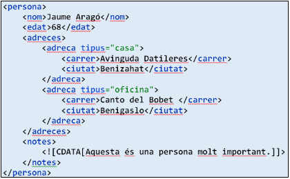

# Jackson. Serialitzant XML


En el desenvolupament d'aplicacions Java, és comú treballar amb dades en format **XML**. A través de la llibreria **Jackson**, que és àmpliament coneguda pel seu suport per a **JSON**, també es poden gestionar documents `XML` de manera senzilla utilitzant la classe **`XmlMapper`**. Aquesta classe permet convertir objectes Java a XML (serialització) i convertir XML a objectes Java (deserialització).

## XmlMapper

**`XmlMapper`** és una classe proporcionada pel mòdul **`jackson-dataformat-xml`** que permet treballar amb XML de manera similar a com es fa amb JSON a través de `ObjectMapper`. Aquesta classe és útil per gestionar dades que es reben o s'envien en format XML, un format de dades estructurat que és utilitzat sovint en aplicacions empresarials, configuracions i serveis web.

### Mètodes de `XmlMapper`

La classe **`XmlMapper`** ofereix diversos mètodes per treballar amb XML i mapejar-lo a objectes Java i viceversa. A continuació es descriuen els mètodes més importants:

| Mètode                      | Descripció                                                                                      |
|-----------------------------|-------------------------------------------------------------------------------------------------|
| **`readValue()`**           | Deserialitza un contingut XML en un objecte Java. Pot llegir des d'una cadena (String), un fitxer, o un `InputStream`. |
| **`writeValue()`**          | Serialitza un objecte Java en un contingut XML. Pot escriure a una cadena (String), un fitxer o un `OutputStream`. |
| **`readTree()`**            | Llegeix un contingut XML com a `JsonNode`, una representació abstracta de les dades, útil per explorar dades XML sense mapar-les a classes concretes. |
| **`writeTree()`**           | Escriu un `JsonNode` com a contingut XML.                                                        |
| **`readValues()`**          | Llegeix una seqüència de documents XML separats.                                                  |
| **`readerForUpdating()`**   | Permet l'actualització incremental d'un objecte Java existent amb dades XML.                      |
| **`getFactory()`**          | Obté l'objecte `JsonFactory` associat amb l'`XmlMapper`. Es pot configurar per gestionar aspectes específics com l'ús de DTDs, espais de noms, etc. |
| **`getSerializationConfig()`** | Obté la configuració de serialització per personalitzar aspectes com la indentació o la inclusió d'espais de noms XML. |
| **`getDeserializationConfig()`** | Obté la configuració de deserialització per gestionar opcions específiques de l'anàlisi XML, com reconèixer espais de noms o CDATA. |
| **`setConfig()`**           | Configura l'objecte `XmlMapper` amb una nova configuració personalitzada per a gestionar opcions específiques de l'anàlisi o la generació d'XML. |


### Exemples d'ús de `XmlMapper`

1. **Deserialització d'XML en un objecte Java**:
   ```java

   XmlMapper xmlMapper = new XmlMapper();
   String xmlString = "<persona><nom>John</nom><edat>30</edat></persona>";
   Persona persona = xmlMapper.readValue(xmlString, Persona.class);
   ```
   Utilitzem `readValue()` per convertir un fragment d'XML en un objecte Java de la classe `Persona`.

2. **Serialització d'un objecte Java a XML**:
   ```java

   XmlMapper xmlMapper = new XmlMapper();
   Persona persona = new Persona("John", 30);
   String xmlString = xmlMapper.writeValueAsString(persona);
   ```
   `writeValueAsString()` converteix un objecte `Persona` a una cadena XML.

3. **Lectura d'arxius XML**:
   ```java

   XmlMapper xmlMapper = new XmlMapper();
   File xmlFile = new File("persona.xml");
   Persona persona = xmlMapper.readValue(xmlFile, Persona.class);
   ```
   `readValue()` llegeix les dades d'un fitxer XML i les deserialitza en un objecte `Persona`.

4. **Serialització d'objectes Java a un fitxer XML**:
   ```java

   XmlMapper xmlMapper = new XmlMapper();
   Persona persona = new Persona("John", 30);
   xmlMapper.writeValue(new File("persona.xml"), persona);
   ```
   `writeValue()` serialitza un objecte `Persona` i l'emmagatzema com un fitxer XML.

## Anotacions de Jackson per a XML

Jackson ofereix diverses anotacions per personalitzar el mapeig entre objectes Java i XML, similar a les anotacions que es fan servir amb JSON. A continuació es detallen les anotacions més importants per treballar amb XML:

1. **`@JacksonXmlProperty`**:  
   Anotació que s'utilitza per mapejar un camp d'una classe Java a un element XML específic. Amb `localName`, es defineix el nom de l'element en l'XML.

   ```java

   import com.fasterxml.jackson.dataformat.xml.annotation.JacksonXmlProperty;

   public class Persona {
       @JacksonXmlProperty(localName = "Nom")
       private String nom;

       @JacksonXmlProperty(localName = "Edat")
       private int edat;

       // Getters i Setters
       public String getNom() { return nom; }
       public void setNom(String nom) { this.nom = nom; }

       public int getEdat() { return edat; }
       public void setEdat(int edat) { this.edat = edat; }
   }
   ```
   **Resultat XML**:
   ```xml
   <Persona>
       <Nom>John</Nom>
       <Edat>30</Edat>
   </Persona>
   ```
   L'atribut `nom` es mapeja a l'element XML `<Nom>`, i `edat` es mapeja a `<Edat>`, seguint el nom específicat a l'anotació.

2. **`@JacksonXmlElementWrapper`**:  
   
   S'utilitza per encapsular una llista d'elements dins d'un element de nivell superior, com ara `<alumnes>` que envolta diversos `<alumne>`. Es a dir, permet crear un element que conté una col·lecció d'elements, **(List, Set, Map, etc.)**.

   ```java

   import com.fasterxml.jackson.dataformat.xml.annotation.JacksonXmlElementWrapper;
   import com.fasterxml.jackson.dataformat.xml.annotation.JacksonXmlProperty;
   import java.util.List;

   public class Classe {
       @JacksonXmlElementWrapper(localName = "alumnes")
       @JacksonXmlProperty(localName = "alumne")
       private List<Alumne> alumnes;

       // Getters i Setters
       public List<Alumne> getAlumnes() { return alumnes; }
       public void setAlumnes(List<Alumne> alumnes) { this.alumnes = alumnes; }
   }
   ```
   **Resultat XML**:
   ```xml
   <Classe>
       <alumnes>
           <alumne>
               <nom>Anna</nom>
               <edat>22</edat>
           </alumne>
           <alumne>
               <nom>Marc</nom>
               <edat>23</edat>
           </alumne>
       </alumnes>
   </Classe>
   ```
   A l'exemple, l'anotació `@JacksonXmlElementWrapper` crea l'element `<alumnes>` que conté diversos elements `<alumne>`. Cada alumne es representa amb les seves dades individuals.

3. **`@JacksonXmlText`**:  
   Mapeja el contingut de text d'un element XML directament a un camp de la classe. És útil quan l'element XML no té subelements, només un valor de text.

   ```java

   import com.fasterxml.jackson.dataformat.xml.annotation.JacksonXmlText;

   public class Missatge {
       @JacksonXmlText
       private String text;

       // Constructor, Getter i Setter
       public Missatge(String text) { this.text = text; }
       public String getText() { return text; }
       public void setText(String text) { this.text = text; }
   }
   ```
   **Resultat XML**:
   ```xml

   <Missatge>Benvingut al sistema!</Missatge>
   ```
   L'element `<Missatge>` conté directament el text "Benvingut al sistema!" gràcies a l'anotació `@JacksonXmlText`.

4. **`@JacksonXmlRootElement`**:  
   Aquesta anotació defineix l'element arrel d'una classe Java quan es serialitza a XML.

   ```java

   import com.fasterxml.jackson.dataformat.xml.annotation.JacksonXmlRootElement;

   @JacksonXmlRootElement(localName = "llibre")
   public class Llibre {
       private String titol;
       private String autor;

       // Constructor, Getters i Setters
       public Llibre(String titol, String autor) {
           this.titol = titol;
           this.autor = autor;
       }
       public String getTitol() { return titol; }
       public void setTitol(String titol) { this.titol = titol; }

       public String getAutor() { return autor; }
       public void setAutor(String autor) { this.autor = autor; }
   }
   ```
   **Resultat XML**:
   ```xml

   <llibre>
       <titol>El Nom del Vent</titol>
       <autor>Patrick Rothfuss</autor>
   </llibre>
   ```
   En aquest cas, l'element arrel del document XML és `<llibre>`, gràcies a l'anotació `@JacksonXmlRootElement`.

5. **`@JacksonXmlProperty(isAttribute = true)`**:  
   Aquesta anotació permet mapejar un camp com a un **atribut** d'un element XML.

   ```java

   import com.fasterxml.jackson.dataformat.xml.annotation.JacksonXmlProperty;

   public class Producte {
       @JacksonXmlProperty(isAttribute = true)
       private String id;

       @JacksonXmlProperty(localName = "nom")
       private String nom;

       // Constructor, Getters i Setters
       public Producte(String id, String nom) {
           this.id = id;
           this.nom = nom;
       }
       public String getId() { return id; }
       public void setId(String id) { this.id = id; }

       public String getNom() { return nom; }
       public void setNom(String nom) { this.nom = nom; }
   }
   ```
   **Resultat XML**:
   ```xml

   <Producte id="123">
       <nom>Ordinador</nom>
   </Producte>
   ```
   Aquí, `id` és un atribut de l'element `<Producte>` gràcies a `@JacksonXmlProperty(isAttribute = true)`, mentre que `nom` es manté com un subelement.

6. **`@JacksonXmlCData`**:  
   Aquesta anotació fa que el contingut d'un camp es mapege com un bloc **CDATA** dins de l'XML.

   ```java

   import com.fasterxml.jackson.dataformat.xml.annotation.JacksonXmlCData;

   public class Comentari {
       @JacksonXmlCData
       private String contingut;

       // Constructor, Getter i Setter
       public Comentari(String contingut) { this.contingut = contingut; }
       public String getContingut() { return contingut; }
       public void setContingut(String contingut) { this.contingut = contingut; }
   }
   ```
   **Resultat XML**:
   ```xml

   <Comentari><![CDATA[Això és un comentari amb <caràcters especials>!]]></Comentari>
   ```
   L'anotació `@JacksonXmlCData` fa que el contingut del camp `contingut` es representi com a CDATA, evitant problemes amb caràcters especials en el XML.

### Resum anotacions XML


| Anotació                                 | Descripció                                                                                                       |
|------------------------------------------|------------------------------------------------------------------------------------------------------------------|
| **`@JacksonXmlProperty`**                | Mapeja un camp de la classe Java a un element XML amb un nom específic. Amb `localName` es pot definir el nom de l'element XML. També pot ser utilitzat per marcar un camp com a atribut si s'estableix `isAttribute = true`. |
| **`@JacksonXmlElementWrapper`**          | Envolta una col·lecció (com `List`, `Set`, `Map`) amb un element XML superior. Amb `localName`, s'especifica el nom de l'element que contindrà la llista d'elements. |
| **`@JacksonXmlText`**                    | Mapeja el contingut de text d'un element XML directament a un camp de la classe. S'utilitza quan l'element XML no té atributs ni subelements, només text. |
| **`@JacksonXmlRootElement`**             | Defineix l'element XML arrel per a la classe Java. `localName` especifica el nom de l'element arrel en l'XML.      |
| **`@JacksonXmlCData`**                   | Indica que el contingut del camp ha de ser emmagatzemat com un bloc **CDATA** en el document XML, permetent incloure caràcters especials sense errors de sintaxi. |
| **`@JacksonXmlProperty(isAttribute = true)`** | Mapeja un camp com un atribut d'un element XML, en lloc de com un subelement, afegint-lo com a atribut dins de l'etiqueta XML. |
| **`@JacksonXmlProperty(namespace = "url")`** | Assigna un espai de noms (namespace) a un element XML, útil quan es treballa amb XML que requereix espais de noms específics. |


# Exemples Guiats


## De XML a Java – Deserialitzant amb Jackson

Jackson facilita la conversió de dades XML a objectes Java mitjançant la classe **`XmlMapper`**. Aquest procés es coneix com **deserialització**, i consisteix a transformar un document XML en objectes Java que representen les dades contingudes en l'XML.


>**Important - Dependències Maven:** 
>
> Recorda que has d'afegir les dependències **maven** de **Jackson XML** al teu fitxer `pom.xml` per utilitzar aquesta funcionalitat.
En este cas, necessitem afegir la següent dependència:
>- **jackson-databin** : que importa les classes de Jackson per a la deserialització i serialització d'XML.
>- **jackson-dataformat-xml**: afegeix a Jackson la capacitat de treballar amb XML.


### Partim del següent document XML:

```xml

<persona>
    <nom>Jaume Aragó</nom>
    <edat>68</edat>
    <adreces>
        <adreca tipus="casa">
            <carrer>Avinguda Datileres</carrer>
            <ciutat>Benizahat</ciutat>
        </adreca>
        <adreca tipus="oficina">
            <carrer>Canto del Bobet</carrer>
            <ciutat>Benigaslo</ciutat>
        </adreca>
    </adreces>
    <notes>
        <![CDATA[Esta és una persona molt important.]]>
    </notes>
</persona>
```

### Creem els POJOs

Per crear les classes POJO (Plain Old Java Objects) a partir d'un document XML, cal tenir en compte:
- Identificar els elements i atributs del document XML que es mapegen com a camps a les classes Java.
- Cada element i atribut ha de tenir un camp corresponent a les nostres classes.
- Crear classes Java que representen les estructures del document, cada classe ha de correspondre a un element o grup d'elements relacionats del document XML.

```java

public class Persona {
    private String nom;
    private int edat;
    private List<Adreca> adreces;
    private String notes;
    
    // Constructors, getters i setters
}

public class Adreca {
    private String tipus;
    private String carrer;
    private String ciutat;
    
    // Constructors, getters i setters
}
```

### Posem les Anotacions per al Mapejament XML

Per a indicar com fer el mapeig entre els elements XML i els camps de les classes Java, cal afegir anotacions de Jackson. Utilitzem les anotacions següents:


- **`@JacksonXmlRootElement`**: Indica l'element XML arrel que representa la classe Java.
- **`@JacksonXmlProperty`**: Indica com s'ha de mapejar un camp a un element XML.
- **`@JacksonXmlElementWrapper`**: S'utilitza per gestionar col·leccions dins d'elements agrupats.
- **`@JacksonXmlText`**: Mapeja el contingut de text d'un element XML directament a un camp Java.


```java

import com.fasterxml.jackson.dataformat.xml.annotation.JacksonXmlElementWrapper;
import com.fasterxml.jackson.dataformat.xml.annotation.JacksonXmlProperty;
import com.fasterxml.jackson.dataformat.xml.annotation.JacksonXmlRootElement;
import com.fasterxml.jackson.dataformat.xml.annotation.JacksonXmlText;

@JacksonXmlRootElement(localName = "persona")
public class Persona {
    @JacksonXmlProperty(localName = "nom")
    private String nom;
    
    @JacksonXmlProperty(localName = "edat")
    private int edat;
    
    @JacksonXmlElementWrapper(localName = "adreces")
    @JacksonXmlProperty(localName = "adreca")
    private List<Adreca> adreces;
    
    @JacksonXmlText(value = false)
    private String notes;
    
    // Constructors, getters i setters
}

public class Adreca {
    @JacksonXmlProperty(isAttribute = true, localName = "tipus")
    private String tipus;
    
    @JacksonXmlProperty(localName = "carrer")
    private String carrer;
    
    @JacksonXmlProperty(localName = "ciutat")
    private String ciutat;
    
    // Constructors, getters i setters
}
```



{: .text-center }


## Deserialització d'XML en un Objecte Java

Una volta tenim les classes POJO amb les anotacions adequades, podem utilitzar **`XmlMapper`** per deserialitzar l'XML en un objecte Java.

L'objecte resultant pot accedir a les dades XML a través dels seus mètodes getters.

### Creem la Classe Principal

• Creem una instància de la classe `XmlMapper` de Jackson per treballar amb XML:
```java

XmlMapper xmlMapper = new XmlMapper();
```

• Utilitzem `XmlMapper` per llegir i deserialitzar el contingut del document XML en una instància de la classe `Persona`:

```java

Persona persona = xmlMapper.readValue(xml, Persona.class);
```

• Comprovem les dades deserialitzades mostrant-les per pantalla (amb els `GETTER`s i, en l'exemple, amb un `FOR..EACH` per a la col·lecció).

• Gestionem les possibles excepcions amb `throws` o un `try-catch`.

### Deserialització des d'una Cadena XML

```java

import com.fasterxml.jackson.dataformat.xml.XmlMapper;

public class Main {
    public static void main(String[] args) throws Exception {
        XmlMapper xmlMapper = new XmlMapper();
        String xml = "<persona>... (com es mostra més amunt) ...</persona>";
        Persona persona = xmlMapper.readValue(xml, Persona.class);

        System.out.println("Nom: " + persona.getNom());
        System.out.println("Edat: " + persona.getEdat());
        System.out.println("Notes: " + persona.getNotes());

        for (Adreca adreca : persona.getAdreces()) {
            System.out.println("Tipus d'adreça: " + adreca.getTipus());
            System.out.println("Carrer: " + adreca.getCarrer());
            System.out.println("Ciutat: " + adreca.getCiutat());
            System.out.println();
        }
    }
}
```


**Sortida esperada *

```

Nom: Jaume Aragó
Edat: 68
Notes: Esta és una persona molt important.
Tipus d'adreça: casa
Carrer: Avinguda Datileres
Ciutat: Benizahat

Tipus d'adreça: oficina
Carrer: Canto del Bobet
Ciutat: Benigaslo
```


### Deserialització des d'un Fitxer XML

També es pot deserialitzar l'XML a partir d'un fitxer utilitzant la classe `File`.
Aquí tens el codi reescrit i formatat:

```java

import com.fasterxml.jackson.dataformat.xml.XmlMapper;
import java.io.File;

public class Main {
    public static void main(String[] args) {
        XmlMapper xmlMapper = new XmlMapper();
        File xmlFile = new File("persona.xml");

        try {
            if (xmlFile.exists()) {
                // Deserialitzar el fitxer XML a un objecte Persona
                Persona persona = xmlMapper.readValue(xmlFile, Persona.class);

                // Mostrar les dades deserialitzades per pantalla
                System.out.println("Nom: " + persona.getNom());
                System.out.println("Edat: " + persona.getEdat());
                System.out.println("Notes: " + persona.getNotes());

                // Iterar sobre les adreces i mostrar-ne la informació
                for (Adreca adreca : persona.getAdreces()) {
                    System.out.println("Tipus d'adreça: " + adreca.getTipus());
                    System.out.println("Carrer: " + adreca.getCarrer());
                    System.out.println("Ciutat: " + adreca.getCiutat());
                    System.out.println();
                }
            } else {
                System.err.println("El fitxer XML no existeix.");
            }
        } catch (Exception e) {
            e.printStackTrace();
        }
    }
}
```

### Descripció del Codi:

- **Importacions**: Importa la classe `XmlMapper` per treballar amb XML i la classe `File` per gestionar fitxers.
- **Creació de l'Objecte `XmlMapper`**: Facilita la deserialització del fitxer XML en un objecte Java.
- **Creació del fitxer XML**: Es defineix un objecte `File` que apunta a "persona.xml".
- **Verificació de l'Existència del Fitxer**: Es comprova si el fitxer existeix abans de processar-lo.
- **Deserialització**: Si el fitxer existeix, es converteix el contingut XML a un objecte de la classe `Persona`.
- **Visualització de les dades**: Es mostren les propietats de l'objecte `Persona` i les seves adreces per pantalla.
- **Gestió d'Excepcions**: Si es produeix una excepció durant la deserialització o el processament del fitxer, aquesta es captura i mostra amb `e.printStackTrace()`.

El codi llegeix un fitxer XML, el converteix en un objecte Java de la classe `Persona`, i en mostra les dades per pantalla, incloent la informació de les seves adreces. Si el fitxer no existeix, es mostra un missatge d'error.


**Sortida esperada (si el fitxer `persona.xml` conté el mateix contingut que l'exemple XML anterior):**

```

Nom: Jaume Aragó
Edat: 68
Notes: Esta és una persona molt important.
Tipus d'adreça: casa
Carrer: Avinguda Datileres
Ciutat: Benizahat

Tipus d'adreça: oficina
Carrer: Canto del Bobet
Ciutat: Benigaslo
```

---

## De Java a XML – Serialitzant amb Jackson

La serialització converteix un objecte Java en un document XML. Jackson facilita aquest procés amb la classe **`XmlMapper`**.

>**Dependències Maven:** 
>
> Hem d'incorporar les mateixes dependències **maven** per a  **Jackson** que als exemples anteriors. Per tant, afegim al `pom.xml`: 
>
>- **jackson-databin** : que importa les classes de Jackson per a la deserialització i serialització d'XML.
>- **jackson-dataformat-xml**: afegeix a Jackson la capacitat de treballar amb XML.

### Creem les Classes POJO

Per a la serialització, utilitzem les mateixes classes `Persona` i `Adreca` que hem definit anteriorment.

```java

public class Persona {
    private String nom;
    private int edat;
    private List<Adreca> adreces;
    private String notes;
    
    // Constructors, getters i setters
}

public class Adreca {
    private String tipus;
    private String carrer;
    private String ciutat;
    
    // Constructors, getters i setters
}
```

### Posem les anotacions per al mapejament XML

Igual que en la deserialització, per indicar com realitzar el mapeig entre els elements XML i els camps de les classes Java, hem d'utilitzar anotacions de Jackson. `@JacksonXmlRootElement, @JacksonXmlProperty, @JacksonXmlElementWrapper, @JacksonXmlText`, entre d'altres.

```java

import com.fasterxml.jackson.dataformat.xml.annotation.JacksonXmlElementWrapper;
import com.fasterxml.jackson.dataformat.xml.annotation.JacksonXmlProperty;
import com.fasterxml.jackson.dataformat.xml.annotation.JacksonXmlRootElement;
import com.fasterxml.jackson.dataformat.xml.annotation.JacksonXmlText;
import java.util.List;

@JacksonXmlRootElement(localName = "persona")
public class Persona {
    @JacksonXmlProperty(localName = "nom")
    private String nom;
    
    @JacksonXmlProperty(localName = "edat")
    private int edat;
    
    @JacksonXmlElementWrapper(localName = "adreces")
    @JacksonXmlProperty(localName = "adreca")
    private List<Adreca> adreces;
    
    @JacksonXmlText
    private String notes;

    // Constructors
    public Persona() {}

    public Persona(String nom, int edat, List<Adreca> adreces, String notes) {
        this.nom = nom;
        this.edat = edat;
        this.adreces = adreces;
        this.notes = notes;
    }

    // Getters i Setters
    public String getNom() {
        return nom;
    }

    public void setNom(String nom) {
        this.nom = nom;
    }

    public int getEdat() {
        return edat;
    }

    public void setEdat(int edat) {
        this.edat = edat;
    }

    public List<Adreca> getAdreces() {
        return adreces;
    }

    public void setAdreces(List<Adreca> adreces) {
        this.adreces = adreces;
    }

    public String getNotes() {
        return notes;
    }

    public void setNotes(String notes) {
        this.notes = notes;
    }
}

public class Adreca {
    @JacksonXmlProperty(localName = "tipus")
    private String tipus;

    @JacksonXmlProperty(localName = "carrer")
    private String carrer;

    @JacksonXmlProperty(localName = "ciutat")
    private String ciutat;

    // Constructors
    public Adreca() {}

    public Adreca(String tipus, String carrer, String ciutat) {
        this.tipus = tipus;
        this.carrer = carrer;
        this.ciutat = ciutat;
    }

    // Getters i Setters
    public String getTipus() {
        return tipus;
    }

    public void setTipus(String tipus) {
        this.tipus = tipus;
    }

    public String getCarrer() {
        return carrer;
    }

    public void setCarrer(String carrer) {
        this.carrer = carrer;
    }

    public String getCiutat() {
        return ciutat;
    }

    public void setCiutat(String ciutat) {
        this.ciutat = ciutat;
    }
}

```

### Creem la Classe Principal


```java

import com.fasterxml.jackson.dataformat.xml.XmlMapper;
import java.util.ArrayList;
import java.util.List;

public class Principal {
    public static void main(String[] args) {


        // Inicialitza l'XmlMapper

        XmlMapper xmlMapper = new XmlMapper();

        // Crear una instància de Persona

        Persona persona = new Persona();
        persona.setNom("Jaume Aragó");
        persona.setEdat(68);
        persona.setNotes("Esta és una persona molt important.");
        
        List<Adreca> adreces = new ArrayList<>();
        Adreca casa = new Adreca();
        casa.setTipus("casa");
        casa.setCarrer("Avinguda Datileres");
        casa.setCiutat("Benizahat");
        adreces.add(casa);

        Adreca oficina = new Adreca();
        oficina.setTipus("oficina");
        oficina.setCarrer("Canto del Bobet");
        oficina.setCiutat("Benigaslo");
        adreces.add(oficina);

        persona.setAdreces(adreces);

        try {
            // Serialitzar Persona a XML
            String xml = xmlMapper.writeValueAsString(persona);
            System.out.println(xml);
        } catch (Exception e) {
            e.printStackTrace();
        }
    }
}
```


**Sortida esperada:**


```xml

<persona>
    <nom>Jaume Aragó</nom>
    <edat>68</edat>
    <adreces>
        <adreca tipus="casa">
            <carrer>Avinguda Datileres</carrer>
            <ciutat>Benizahat</ciutat>
        </adreca>
        <adreca tipus="oficina">
            <carrer>Canto del Bobet</carrer>
            <ciutat>Benigaslo</ciutat>
        </adreca>
    </adreces>
    <notes>Esta és una persona molt important.</notes>
</persona>
```

### Usant un fitxer, la classe File i un Filewriter

Aquí tens el codi estructurat i formatejat:

```java

import com.fasterxml.jackson.dataformat.xml.XmlMapper;
import java.io.File;
import java.io.FileWriter;

public class Principal {
    public static void main(String[] args) {

        // Inicialitza l'XmlMapper

        XmlMapper xmlMapper = new XmlMapper();

        // Crear una instància de Persona
        Persona persona = new Persona();
        persona.setNom("Jaume Aragó");
        persona.setEdat(68);

        // Configurar altres camps de Persona i Adreca si és necessari

        try {
            // Serialitzar Persona com a XML
            String xml = xmlMapper.writeValueAsString(persona);

            // Especificar la ruta del fitxer on voleu guardar l'XML
            String rutaFitxer = "persona.xml";

            // Crear un fitxer i escriure-hi l'XML
            File fitxer = new File(rutaFitxer);
            FileWriter fileWriter = new FileWriter(fitxer);
            fileWriter.write(xml);
            fileWriter.close();

            System.out.println("L'XML s'ha guardat correctament a " + rutaFitxer);
        } catch (Exception e) {
            e.printStackTrace();
        }
    }
}
```

### Descripció del codi:

- **Crear la instància de `XmlMapper`**: És la classe que facilita la conversió d'objectes Java a XML.
- **Crear una instància de `Persona`**: Assigna valors als camps de l'objecte `Persona` (nom i edat).
- **Serialitzar a XML**: Utilitza el mètode `writeValueAsString()` de `XmlMapper` per convertir l'objecte `Persona` a una cadena XML.
- **Especificar la ruta del fitxer**: Indica el nom del fitxer (`persona.xml`) on es guardarà el contingut XML.
- **Escriure l'XML al fitxer**: Utilitza `FileWriter` per escriure la cadena XML al fitxer i després tanca el `FileWriter`.
- **Gestió d'excepcions**: Amb un bloc `try-catch`, es gestiona qualsevol excepció que pugui ocórrer durant la serialització o escriptura del fitxer.


## Exemple Complet:


```java

import com.fasterxml.jackson.dataformat.xml.XmlMapper;
import com.fasterxml.jackson.dataformat.xml.ser.ToXmlGenerator;
import com.fasterxml.jackson.databind.SerializationFeature;
import java.io.FileWriter;
import java.util.ArrayList;
import java.util.List;

public class Principal {
    public static void main(String[] args) {
        try {
            // Crea una nova instància de Persona amb les dades especificades
            Persona persona = new Persona();
            persona.setNom("Jaume Aragó");
            persona.setEdat(68);

            Adreca adrecaCasa = new Adreca();
            adrecaCasa.setTipus("casa");
            adrecaCasa.setCarrer("Avinguda Datileres");
            adrecaCasa.setCiutat("Benizahat");

            Adreca adrecaOficina = new Adreca();
            adrecaOficina.setTipus("oficina");
            adrecaOficina.setCarrer("Canto del Bobet");
            adrecaOficina.setCiutat("Benigaslo");

            List<Adreca> adreces = new ArrayList<>();
            adreces.add(adrecaCasa);
            adreces.add(adrecaOficina);
            persona.setAdreces(adreces);

            String notes = "Aquesta és una persona molt important.";
            persona.setNotes(notes);

            // Inicialitza l'XmlMapper
            XmlMapper xmlMapper = new XmlMapper();

            // Afig la declaració (capçalera de l'XML)
            xmlMapper.configure(ToXmlGenerator.Feature.WRITE_XML_DECLARATION, true);
            // Habilita la identació de l'XML
            xmlMapper.enable(SerializationFeature.INDENT_OUTPUT);

            // Serialitza l'objecte Persona com a XML
            String xml = xmlMapper.writeValueAsString(persona);

            // Guarda l'XML com a fitxer "persona.xml"
            FileWriter fileWriter = new FileWriter("persona.xml");
            fileWriter.write(xml);
            fileWriter.close();

            System.out.println("L'XML s'ha creat i guardat com a fitxer persona.xml.");
        } catch (Exception e) {
            e.printStackTrace();
        }
    }
}
```

### Notícies sobre el Codi

- **Configuració de la Capçalera XML**:
  
  La línia:
  
  ```java

  xmlMapper.configure(ToXmlGenerator.Feature.WRITE_XML_DECLARATION, true);
  ```
  
  Configura `xmlMapper` per incloure una **declaració XML** (XML Declaration) a la sortida quan es serialitza un objecte a XML. La declaració XML és una línia opcional al principi d'un document XML que especifica la versió de XML i la codificació de caràcters utilitzada en el document. En aquest cas, es genera una línia com aquesta:

  ```xml

  <?xml version="1.0" encoding="UTF-8"?>
  ```

- **Identació de l'XML**:

  La línia:
  
  
  xmlMapper.enable(SerializationFeature.INDENT_OUTPUT);
  ```
  
  Fa que l'XML generat siga **indentat**, és a dir, afegeix espais i salts de línia per a fer-lo més llegible. Per exemple, un XML amb identació es veuria així:

  ```xml

  <?xml version="1.0" encoding="UTF-8"?>
  <persona>
      <nom>Jaume Aragó</nom>
      <edat>68</edat>
      <!-- altres elements i atributs -->
  </persona>
  ```

### Nota sobre l'ús de CDATA en `notes`

Si volem que `<notes>` aparega com a **CDATA** en la classe `Persona`, hem de modificar el camp `notes` de la següent manera:

```java

@JacksonXmlCData
private String notes;
```

En lloc de:

```java

@JacksonXmlText(value = false)
private String notes;
```

Aquesta modificació fa que el contingut de `notes` es guarde en l'XML dins d'una secció CDATA, així:

```xml

<notes><![CDATA[Aquesta és una persona molt important.]]></notes>
```

### Eixida Esperada del Codi:

Si es configura correctament la classe `Persona` i el codi es compila i s'executa, es generaria un fitxer `persona.xml` amb un contingut similar al següent:

```xml

<?xml version="1.0" encoding="UTF-8"?>
<persona>
    <nom>Jaume Aragó</nom>
    <edat>68</edat>
    <adreces>
        <adreca tipus="casa">
            <carrer>Avinguda Datileres</carrer>
            <ciutat>Benizahat</ciutat>
        </adreca>
        <adreca tipus="oficina">
            <carrer>Canto del Bobet</carrer>
            <ciutat>Benigaslo</ciutat>
        </adreca>
    </adreces>
    <notes><![CDATA[Aquesta és una persona molt important.]]></notes>
</persona>
```

El codi crea una instància de la classe `Persona`, la configura amb dades específiques, i la serialitza a un fitxer XML amb el contingut esmentat, incloent-hi la capçalera XML i la secció CDATA si es configura el camp `notes` com a tal.