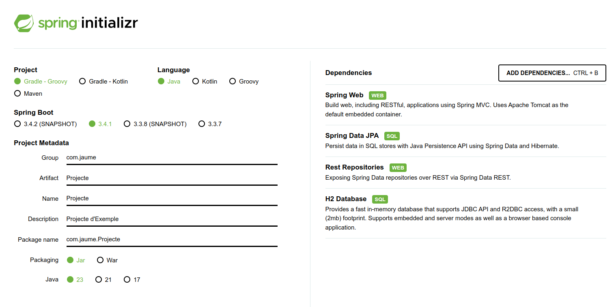
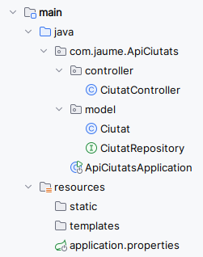
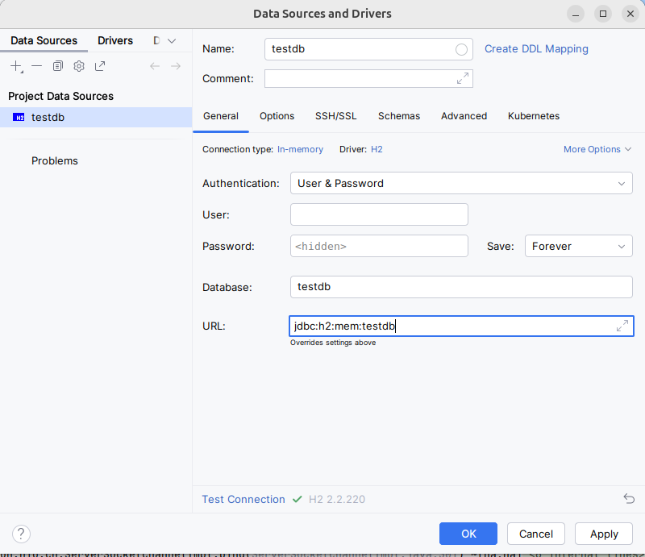
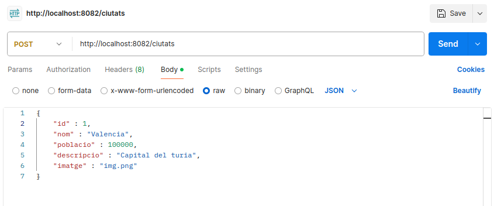

# Creació API Rest Bàsica

Com a punt de partida, crearem una API Bàsica d'una sola taula.
Utilitzarem:

- Spring Boot
- Spring Data JPA
- Base de Dades H2 en memòria.
- Postman, per a proves dels **endPoints** de la API que gererem.

Mapejarem una taula amb anotacions JPA, crearem un controlador i un servei, i una connexió a H2

### Creació del Projecte Spring Boot

Accedim a spring initializer: [Initializr](https://start.spring.io/)





Automàticament es generaran les dependències **gradle** necessàries i el projecte es descarregarà en un zip.

### Configuració del Projecte.

- **Estructura**

La nostra API bàsica tindrà la següent estructura:

  



- **1.- application.properies**

L'arxiu de configuració `application.properties` és un arxiu de propietats que conté valors clau-valor i és utilitzat per configurar l'aplicació Spring Boot. 
Es pot utilitzar per configurar la connexió a la base de dades, el port del servidor, etc.

```bash

# Configurem el port del servidor (per defecte és el 8080)
server.port=8080

# Activem la consola de la base de dades H2
spring.h2.console.enabled=true

# Configuració de la base de dades
spring.datasource.url=jdbc:h2:mem:testdb
spring.datasource.driverClassName=org.h2.Driver
spring.datasource.username=sa
spring.datasource.password=sa

# Indicacions per a Hibernate sobre la gestió dels canvis a la base de dades
spring.jpa.hibernate.ddl-auto=update
```


- **2.- Connexió amb la Base de Dades H2**

Configurem des d'IntelliJ la connexió a la base de dades H2:

- Crearem un datasource amb el nom que hem posat a l'arxiu **application.properties (testdb)**
- La URL de connexió és la que hem posat a l'arxiu de configuració.
- L'usuari i la contrasenya són els que s'indiquen a l'arxiu de configuració.

Realizem el test de connexió per comprovar que tot està correcte.





### Classe Ciutat - JPA

- **Classe Inicial**

```java

public class Ciutat {

    private Long id;
    private String nom;
    private int poblacio;
    private String descripcio;
    private String imatge;

    // Constructors (els 2) , Getters i Setters

}
```


- **3.- Entitat Ciutat amb Anotacions JPA**

```java

@Entity
@Table (name = "Ciutat")
public class Ciutat {

    @Id
    @GeneratedValue(strategy = GenerationType.IDENTITY)
    private Long id;
    @Column(nullable = false)
    private String nom;
    private int poblacio;
    private String descripcio;
    private String imatge;

    // Constructors, getters i setters
}
```


### Repositori - CiutatRepository

```java

@Repository
public interface CiutatRepository  extends CrudRepository<Ciutat,Long> {
}
```


### Controlador- CiutatController


```java


@RestController
@RequestMapping("/ciutats")
public class CiutatController {

    @Autowired
    CiutatRepository ciutatRepository;

    @GetMapping
    public List<Ciutat> obtenirCiutats() {

        return (List<Ciutat>) ciutatRepository.findAll();
    }

    @GetMapping("/{id}")
    public ResponseEntity<Ciutat> obtenirCiutatPerId(@PathVariable(value = "id") Long id) {
        Optional<Ciutat> ciutat = ciutatRepository.findById(id);

        if (ciutat.isPresent()) {
            return ResponseEntity.ok().body(ciutat.get());

        } else {
            return ResponseEntity.notFound().build();
        }
    }


    @PostMapping
    public Ciutat crearCiutat(@RequestBody Ciutat ciutat) {
        return ciutatRepository.save(ciutat);

    }

        @DeleteMapping("/{id}")
    public void eliminarCiutat(@PathVariable Long id) {
        ciutatRepository.deleteById(id);
    }


    @PutMapping("/{id}")
    public ResponseEntity<Ciutat> actualitzarCiutat(@PathVariable Long id, @RequestBody Ciutat ciutatActualitzada) {
        Optional<Ciutat> optionalCiutat = ciutatRepository.findById(id);

        if (optionalCiutat.isPresent()) {
            Ciutat ciutat = optionalCiutat.get();
            ciutat.setNom(ciutatActualitzada.getNom());
            ciutat.setPoblacio(ciutatActualitzada.getPoblacio());
            ciutat.setDescripcio(ciutatActualitzada.getDescripcio());
            ciutat.setImatge(ciutatActualitzada.getImatge());

            return ResponseEntity.ok().body(ciutatRepository.save(ciutat));
        } else {
            return ResponseEntity.notFound().build();
        }
    }

}
```

### Prova de l'API


Una volta creat el projecte, l'executem i provem en el navegador:

- http://localhost:8080

Després connectem el projecte amb **Postman** i inserim dades amb **POST**




