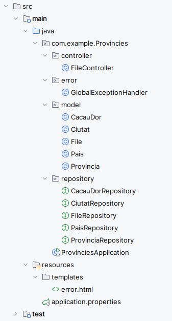

# Estructura d'un projecte Spring boot


**Spring Initializr** és una eina poderosa que facilita la creació de projectes **Spring Boot** personalitzats. Aquesta eina permet configurar fàcilment les opcions principals del projecte, seleccionar les dependències necessàries, i definir metadades clau per començar ràpidament. És útil tant per a desenvolupadors novells com per a experts, i està disponible tant en la seva interfície web com integrada en IDEs populars com IntelliJ IDEA o Eclipse.

---


---

On:

   - **Project**: Tria el sistema de construcció del projecte:
     - **Maven**: Popular i àmpliament utilitzat per gestionar dependències i construir aplicacions Java.
     - **Gradle**: Una alternativa moderna, coneguda per la seva velocitat i flexibilitat.

   - **Language**: Selecciona el llenguatge de programació:
     - **Java**: El llenguatge més utilitzat en l'ecosistema Spring.
     - **Kotlin**: Una opció moderna amb sintaxi més neta i suport natiu de Spring.
     - **Groovy**: Més adequat per a configuracions ràpides o prototips.

   - **Spring Boot version**: Escull la versió de Spring Boot que vols utilitzar (recomanem sempre l'última versió estable).

### **Project Metadata** (metadades del projecte)
Aquestes opcions defineixen els identificadors i l'organització del projecte. Inclouen:

- **Group**:
  - És el nom del **domini invers** que identifica l'organització o el grup responsable del projecte.
  - Normalment segueix el format: `com.nomorganitzacio` o `org.exemple`.
  - Exemple: Si la teva organització es diu "Exemple", pots utilitzar `com.exemple`.
  - **Funció**: És útil per agrupar projectes i evitar conflictes de noms entre aplicacions diferents.

- **Artifact**:
  - Representa el **nom del projecte** o del mòdul principal.
  - És el nom del fitxer JAR o WAR que es generarà quan compiles el projecte.
  - Exemple: Si el teu projecte és una aplicació de gestió d'empleats, pots utilitzar `gestio-empleats`.
  - **Funció**: Identifica de forma única el projecte dins del grup.

- **Name**:
  - És el **nom complet del projecte** que apareixerà com a títol o descripció breu.
  - Aquest nom es pot utilitzar en fitxers de configuració o com a referència dins del codi.
  - Exemple: Per al projecte anterior, el nom pot ser `Aplicació de gestió d'empleats`.
  - **Funció**: Ajuda a descriure el projecte de manera comprensible.

### **Dependencies** (dependències)
- Selecciona les biblioteques necessàries per al teu projecte. Spring Initializr ofereix dependències preconfigurades per facilitar el desenvolupament.
- Exemples comuns:
  - **Spring Web**: Per crear aplicacions web i APIs REST.
  - **Spring Data JPA**: Per connectar-se a bases de dades relacionals.
  - **PostgreSql Driver**: Per interactuar amb una base de dades MySQL.

3. Fes clic a **Generate**. Descarregaràs un fitxer **ZIP** que conté l'estructura del projecte i les configuracions necessàries.

4. Descomprimeix el fitxer ZIP i importa'l al teu IDE.


## Estructura d'un projecte Spring Boot

Quan generem un projecte amb **Spring Initializr** o el configurem manualment, el projecte segueix una estructura ben definida. Aquesta organització facilita el manteniment i l’escalabilitat del codi.

### Diagrama de l'estructura típica

```
📂 projecte-spring-boot
 ┣ 📂 src
 ┃ ┣ 📂 main
 ┃ ┃ ┣ 📂 java
 ┃ ┃ ┃ ┗ 📂 com.exemple
 ┃ ┃ ┃   ┣ AplicacioSpringBoot.java
 ┃ ┃ ┃   ┣ 📂 controller
 ┃ ┃ ┃   ┃ ┗ ExempleController.java
 ┃ ┃ ┃   ┣ 📂 service
 ┃ ┃ ┃   ┃ ┗ ExempleService.java
 ┃ ┃ ┃   ┣ 📂 repository
 ┃ ┃ ┃   ┃ ┗ ExempleRepository.java
 ┃ ┃ ┃   ┗ 📂 model
 ┃ ┃ ┃     ┗ ExempleEntity.java
 ┃ ┃ ┣ 📂 resources
 ┃ ┃ ┃ ┣ application.properties
 ┃ ┃ ┃ ┣ schema.sql
 ┃ ┃ ┃ ┗ data.sql
 ┃ ┗ 📂 test
 ┃   ┗ 📂 java
 ┃     ┗ 📂 com.exemple
 ┃       ┗ AplicacioSpringBootTests.java
 ┣ 📄 pom.xml
 ┗ 📄 README.md
```

### Pricipals directòris de l'estructura Spring

- **src/main/java**: Conté el codi font de l'aplicació.
  - **AplicacioSpringBoot.java**: Classe principal anotada amb `@SpringBootApplication`, que serveix com el punt d'entrada de l'aplicació.
  - **controller**: Conté els controladors que gestionen les peticions HTTP. (**API REST: Get, Post, Put, Delete**)
  - **service**: Inclou la lògica de negoci.
  - **repository**: Gestiona l'accés a la base de dades.
  - **model**: Inclou les entitats JPA que representen les taules de la base de dades.

- **src/main/resources**: Conté recursos que l'aplicació utilitza en temps d'execució.
  - **application.properties**: Fitxer de configuració principal.
  - **schema.sql**: Fitxer opcional per definir l’esquema de la base de dades.
  - **data.sql**: Fitxer opcional per carregar dades inicials.

- **src/test/java**: Conté les proves unitàries i d'integració.

- **pom.xml**: Fitxer de Maven on es defineixen les dependències del projecte.

---



---

**Exemples**

- Classe principal:


```java

package com.exemple;

import org.springframework.boot.SpringApplication;
import org.springframework.boot.autoconfigure.SpringBootApplication;

@SpringBootApplication
public class AplicacioSpringBoot {
    public static void main(String[] args) {
        SpringApplication.run(AplicacioSpringBoot.class, args);
    }
}
```

- Controlador:

```java
package com.exemple.controller;

import org.springframework.web.bind.annotation.GetMapping;
import org.springframework.web.bind.annotation.RestController;

@RestController
public class ExempleController {

    @GetMapping("/")
    public String inici() {
        return "Benvingut a l'aplicació Spring Boot!";
    }
}
```

---

## Configuració  amb `application.properties` o `application.yml`

En un projecte Spring Boot, el fitxer **`application.properties`** o **`application.yml`** és el cor de la configuració. Aquest fitxer ens permet establir valors per defecte i configurar components com la base de dades, el servidor o les propietats de seguretat.

#### Diferències entre `application.properties` i `application.yml`

| **Aspecte**         | **application.properties**       | **application.yml**         |
|----------------------|-----------------------------------|-----------------------------|
| **Format**           | Clau-valor (pla i senzill).      | Jeràrquic (organitzat amb indentació). |
| **Complexitat**      | Fàcil per a configuracions senzilles. | Millor per a configuracions estructurades. |

Exemple amb `application.properties`:
```properties

server.port=8081
spring.datasource.url=jdbc:mysql://localhost:3306/exemple_db
spring.datasource.username=root
spring.datasource.password=1234
spring.jpa.show-sql=true

```

Exemple equivalent amb `application.yml`:
```yaml
server:
  port: 8081

spring:
  datasource:
    url: jdbc:mysql://localhost:3306/exemple_db
    username: root
    password: 1234
  jpa:
    show-sql: true
```

**Configuració de components principals:**

1. **Servidor**:
   - Canviar el port predeterminat (8080):
     ```properties
     server.port=8081
     ```

2. **Base de dades**:
   - Configuració d'una base de dades PostgreSql:
     ```properties
     spring.datasource.url=jdbc:postgresql://localhost:5432/exemple_db
     spring.datasource.username=postgres
     spring.datasource.password=1234
     spring.jpa.hibernate.ddl-auto=update

     ```

3. **Log de consultes SQL**:
   - Per veure les consultes SQL generades:
     ```properties
     spring.jpa.show-sql=true
     spring.jpa.properties.hibernate.format_sql=true
     ```

4. **Perfils d'entorn**:
   - Configuració basada en perfils (`dev`, `prod`, etc.):
     ```properties
     spring.profiles.active=dev
     ```
   - Exemple de fitxers: `application-dev.properties` per a desenvolupament i `application-prod.properties` per a producció.

**Exemple pràctic de configuració**

1. Configuració `application.properties` per a una aplicació amb PostgreSQL i un port personalitzat:
   ```properties
   server.port=8081

   spring.datasource.url=jdbc:postgresql://localhost:5432/empresa
   spring.datasource.username=admin
   spring.datasource.password=secret
   spring.jpa.hibernate.ddl-auto=update
   spring.jpa.show-sql=true
   ```

2. `schema.sql` per inicialitzar l’esquema:
   ```sql
   CREATE TABLE empleat (
       id BIGSERIAL PRIMARY KEY,
       nom VARCHAR(50) NOT NULL,
       cognom VARCHAR(50) NOT NULL,
       email VARCHAR(100) UNIQUE
   );
   ```

3. `data.sql` per carregar dades inicials:
   ```sql
   INSERT INTO empleat (nom, cognom, email) VALUES ('Jaume', 'Aragó', 'jaume@example.com');
   INSERT INTO empleat (nom, cognom, email) VALUES ('Maria Isabel', 'Sanahuja', 'bel@example.com');
   ```

---

- L'estructura del projecte Spring Boot està pensada per separar clarament les responsabilitats i facilitar el manteniment.
- Els fitxers de configuració `application.properties` o `application.yml` són crucials per definir el comportament de l'aplicació.
- Amb configuracions senzilles, com el port del servidor o la connexió a la base de dades, podem personalitzar completament l'entorn.