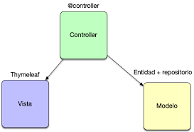
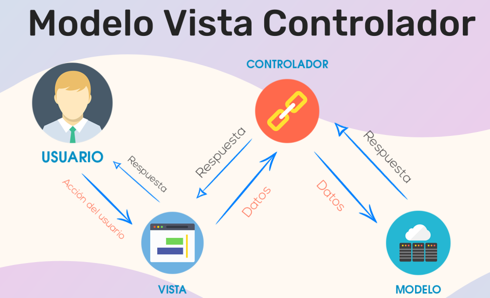

# **Arquitectura MVC i components bàsics en Spring Boot**

El patró **Model-View-Controller (MVC)** és una de les arquitectures més utilitzades en el desenvolupament d'aplicacions. 

---


---

## **1.- Patró Model-View-Controller (MVC)**


MVC és un patró de disseny que separa les responsabilitats d'una aplicació en tres components principals:
- **Model**: Gestiona les dades, la lògica de negoci i les regles d'aplicació.
- **View**: És la interfície d'usuari. Mostra les dades al client i permet la interacció.
- **Controller**: Gestiona les peticions de l'usuari, interacciona amb el Model i actualitza la View.

**Objectius del patró MVC**
1. **Separació de responsabilitats**:
   - Cada component té un paper clar i independent.
2. **Facilitat de manteniment**:
   - Modificar la interfície (View) no afecta la lògica de negoci (Model).
3. **Escalabilitat**:
   - És fàcil afegir noves funcionalitats o modificar components.

**Relació entre els components**
- El **Controller** rep les peticions de l'usuari.
- El **Controller** comunica amb el **Model** per obtenir o actualitzar dades.
- Les dades del **Model** s'envien al **Controller**, que les passa a la **View** per ser renderitzades.

---

## **2.- Components principals de Spring Boot**

En Spring Boot, l'arquitectura MVC es divideix en tres parts principals, cadascuna amb les seues especificitats.

## **2.1. MODEL: Entitats i persistència**

El **Model** és responsable de gestionar les dades de l'aplicació. En Spring Boot, normalment s'implementa amb:
1. **Entitats JPA**: Representen taules de la base de dades.
2. **Repositoris**: Gestionen l'accés a la base de dades.
3. **Lògica de negoci**: Es pot implementar en classes de servei.

**Exemple**
Creem una entitat `Empleat` per representar una taula de la base de dades.

```java
package com.example.model;

import jakarta.persistence.*;

@Entity
@Table(name = "empleat")
public class Empleat {

    @Id
    @GeneratedValue(strategy = GenerationType.IDENTITY)
    private Long id;

    private String nom;

    private String cognom;

    private String email;

    // Getters i Setters
    public Long getId() { return id; }
    public void setId(Long id) { this.id = id; }
    public String getNom() { return nom; }
    public void setNom(String nom) { this.nom = nom; }
    public String getCognom() { return cognom; }
    public void setCognom(String cognom) { this.cognom = cognom; }
    public String getEmail() { return email; }
    public void setEmail(String email) { this.email = email; }
}
```

### **Repositori**
Creem una interfície per accedir a la base de dades.

```java
package com.example.repository;

import com.example.model.Empleat;
import org.springframework.data.jpa.repository.JpaRepository;

public interface EmpleatRepository extends JpaRepository<Empleat, Long> {
}
```

### **Servei**
Afegim un servei per encapsular la lògica de negoci:

```java
package com.example.service;

import com.example.model.Empleat;
import com.example.repository.EmpleatRepository;
import org.springframework.stereotype.Service;

import java.util.List;

@Service
public class EmpleatService {

    private final EmpleatRepository empleatRepository;

    public EmpleatService(EmpleatRepository empleatRepository) {
        this.empleatRepository = empleatRepository;
    }

    public List<Empleat> obtenirTotsElsEmpleats() {
        return empleatRepository.findAll();
    }

    public Empleat guardarEmpleat(Empleat empleat) {
        return empleatRepository.save(empleat);
    }
}
```

---

## **2.2. VIEW: Plantilles HTML amb Thymeleaf**

La **View** és responsable de presentar les dades a l'usuari. En Spring Boot, es poden utilitzar diversos motors de plantilles (Thymeleaf, JSP, etc.), però Thymeleaf és el més comú.

**Exemple**
Creem un fitxer `empleats.html` per mostrar una llista d'empleats.

```html
<!DOCTYPE html>
<html xmlns:th="http://www.thymeleaf.org">
<head>
    <title>Llista d'empleats</title>
</head>
<body>
    <h1>Llista d'empleats</h1>
    <table>
        <thead>
            <tr>
                <th>ID</th>
                <th>Nom</th>
                <th>Cognom</th>
                <th>Email</th>
            </tr>
        </thead>
        <tbody>
            <tr th:each="empleat : ${empleats}">
                <td th:text="${empleat.id}"></td>
                <td th:text="${empleat.nom}"></td>
                <td th:text="${empleat.cognom}"></td>
                <td th:text="${empleat.email}"></td>
            </tr>
        </tbody>
    </table>

    <h2>Afegir empleat</h2>
    <form action="/empleats/afegir" method="post">
        <input type="text" name="nom" placeholder="Nom" required />
        <input type="text" name="cognom" placeholder="Cognom" required />
        <input type="email" name="email" placeholder="Email" required />
        <button type="submit">Afegir</button>
    </form>
</body>
</html>
```

---

### **2.3. CONTROLLER: Gestió de peticions HTTP**

El **Controller** és l'encarregat de gestionar les peticions HTTP. En Spring Boot, s'utilitzen anotacions com:
- `@Controller`: Per gestionar vistes.
- `@RestController`: Per APIs REST.

**Exemple**
Creem un controlador per llistar i afegir empleats.

```java
package com.example.controller;

import com.example.model.Empleat;
import com.example.service.EmpleatService;
import org.springframework.stereotype.Controller;
import org.springframework.ui.Model;
import org.springframework.web.bind.annotation.GetMapping;
import org.springframework.web.bind.annotation.PostMapping;

@Controller
public class EmpleatController {

    private final EmpleatService empleatService;

    public EmpleatController(EmpleatService empleatService) {
        this.empleatService = empleatService;
    }

    @GetMapping("/empleats")
    public String llistarEmpleats(Model model) {
        model.addAttribute("empleats", empleatService.obtenirTotsElsEmpleats());
        return "empleats";
    }

    @PostMapping("/empleats/afegir")
    public String afegirEmpleat(Empleat empleat) {
        empleatService.guardarEmpleat(empleat);
        return "redirect:/empleats";
    }
}
```

---

## **3.- Flux de treball dins de Spring MVC**


1. **Petició de l'usuari**:
   - L'usuari accedeix a una URL (ex.: `http://localhost:8080/empleats`).
   - La petició HTTP es dirigeix al controlador corresponent.

2. **El controlador processa la petició**:
   - El mètode anotat amb `@GetMapping` o `@PostMapping` gestiona la petició.
   - Si cal, el controlador interactua amb el model (base de dades, serveis, etc.).

3. **Obtenció de dades del model**:
   - El controlador utilitza el servei per obtenir les dades necessàries.
   - Les dades s'envien a la vista mitjançant un objecte `Model`.

4. **Generació de la vista**:
   - El motor de plantilles (Thymeleaf) processa el fitxer HTML i insereix les dades del model.
   - La vista renderitzada s'envia com a resposta HTTP al navegador.

### **Diagrama del flux MVC en Spring Boot**

```plaintext
Usuari (client)
     |
     V
Petició HTTP (URL)
     |
     V
Controller (@Controller)
     |
     V
Interacció amb Model
     |
     V
Recuperació de dades
     |
     V
Generació de View (Thymeleaf)
     |
     V
Resposta HTTP (HTML)
```

---



---

En definitiva, **MVC en Spring Boot** separa clarament les responsabilitats del Model (dades), View (interfície) i Controller (gestió de flux), garantint mantenibilitat, escalabilitat i flexibilitat en el desenvolupament d'aplicacions web.

---

## **Backend i Frontend amb Spring Boot**

Per integrar un backend desenvolupat amb Spring Boot amb diferents tipus d'aplicacions frontend, es fa utilitzant **APIs REST** o **WebSockets**. Aquestes eines permeten que el backend expose dades i funcionalitats que el frontend pot consumir de manera fàcil i escalable.

---

**Categories d'aplicacions frontend i eines més populars**

- **1. Aplicacions web (Frontend tradicional i SPAs)**
Aquestes aplicacions es renderitzen en el navegador i poden consumir dades del backend a través de peticions HTTP (APIs REST) o WebSockets.

- **Frameworks/Motors de plantilles (Frontend renderitzat al servidor)**:
  - **Thymeleaf** (integració nativa amb Spring Boot).
  - **JSP** (Java Server Pages).
  - **Freemarker**.

- **Single Page Applications (SPAs)**:
  - **React** (JavaScript/TypeScript).
  - **Vue.js** (JavaScript/TypeScript).
  - **Angular** (JavaScript/TypeScript).

- **Eina de comunicació amb el backend**:
  - **Axios** (biblioteca JavaScript per a peticions HTTP).
  - **fetch** (API nativa dels navegadors).
  - **SWR** (capa de gestió de dades per React).

---

- **2. Aplicacions mòbils (Android, iOS i multiplataforma)**

Aquestes aplicacions consumeixen dades del backend per proporcionar funcionalitats a dispositius mòbils. Normalment utilitzen **APIs REST** o, en casos d'actualitzacions en temps real, **WebSockets**.

- **Natiu**:
  - **Android (Java/Kotlin)**: Utilitza biblioteques com Retrofit per consumir APIs REST.
  - **iOS (Swift)**: Utilitza URLSession per consumir APIs REST.

- **Multiplataforma**:
  - **Flutter**: Basat en Dart, utilitza biblioteques com `http` per a peticions REST.
  - **React Native**: Comparteix moltes eines amb React, com Axios o fetch.

---

- **3. Aplicacions d'escriptori**
Aquestes aplicacions es desenvolupen per funcionar en sistemes operatius com Windows, macOS o Linux i consumeixen dades del backend.

- **Eines per al desenvolupament d'aplicacions d'escriptori**:
  - **JavaFX** (Java).
  - **Electron** (JavaScript/TypeScript, ideal per a aplicacions basades en web).
  - **Qt** (C++, amb bindings per a Python).
  - **Swing/AWT** (Java, menys modern però encara en ús).

---

- **4. Aplicacions per a IoT (Internet of Things)**
Aquestes aplicacions gestionen dispositius connectats i solen utilitzar el backend per recollir dades o enviar ordres.

- **Protocols comuns**:
  - **HTTP/REST**: Per interaccions bàsiques.
  - **MQTT**: Per comunicació lleugera i en temps real.
  - **CoAP**: Protocol optimitzat per IoT.

- **Eines populars**:
  - **Node.js**: Combinat amb frameworks com Express.js.
  - **Python**: Amb llibreries com Flask o FastAPI per gestionar el frontend.

---

- **5. Aplicacions híbrides (Web + Mòbil + Escriptori)**
Aquestes aplicacions utilitzen tecnologies compartides per funcionar en múltiples plataformes.

- **Eines per al desenvolupament híbrid**:
  - **Ionic** (HTML5/CSS/JavaScript, ideal per a web i mòbil).
  - **Flutter** (Dart, per a mòbil i escriptori).
  - **React Native + Expo** (per a mòbil amb possibilitat d’integració web).

---

**Taula Resum**

| **Categoria**               | **Eines populars**                                                                         |
|------------------------------|-------------------------------------------------------------------------------------------|
| Aplicacions web             | Thymeleaf, React, Vue.js, Angular                                                         |
| Aplicacions mòbils          | Android (Retrofit), iOS (URLSession), Flutter (http), React Native (Axios)                |
| Aplicacions d'escriptori    | JavaFX, Electron, Qt, Swing                                                               |
| Aplicacions IoT             | MQTT, HTTP/REST, CoAP, Node.js, Python                                                    |
| Aplicacions híbrides        | Ionic, Flutter, React Native + Expo                                                       |

---

**Com s'integra amb Spring Boot?**

1. **Backend (Spring Boot)**:
   - Exposa APIs REST amb `@RestController`.
   - Configura CORS si el frontend està en un domini diferent:
     ```java
     @CrossOrigin(origins = "http://localhost:3000")
     ```

2. **Frontend**:
   - Consumeix APIs REST amb eines com Axios, fetch o biblioteques equivalents.
   - Si utilitzes WebSockets, Spring Boot proporciona una integració fàcil amb **STOMP** i **SockJS**.

