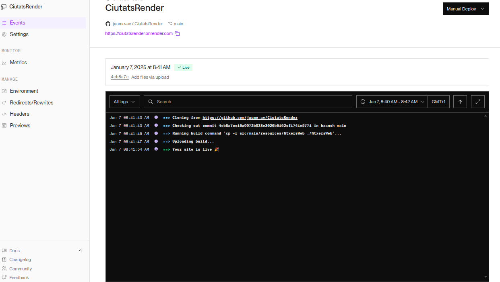

# Desplegament amb Render

Desplegarem el nostre projecte de la 1a Avaluació (**Projecte Fitxers**) a partrie d'un repositori **GitHub**.


## Passos

1.- Inicia sessió al teu compte de Render. (Usarem el compte de GitHub per a l'autenticació)

2.- Fes clic a "New" i selecciona "Static Site", ja que, en el nostre exemple, desplegarem una aplicació estàtica.

3.- Connecta el teu compte de GitHub i autoritza Render a accedir als teus repositoris. Selecciona el repositori que conté l'aplicació web. Render detectarà automàticament la configuració per defecte, com ara el llenguatge de programació i el framework utilitzat.


On:

-**Source Code**
Indica el repositori de codi font des del qual Render obtindrà els arxius per al desplegament.
- **Exemple**: `jaume-av / CiutatsRender`.
- Es pot editar per canviar el repositori seleccionat.

- **Name**
El nom únic del vostre servei o lloc web estàtic, este nom s'utilitza per generar la URL pública del lloc (per exemple, `example-service-name.onrender.com`).
- **Exemple**: `ciutats-web`.

- **Project  (opcional)**.
Assigna aquest lloc web estàtic a un projecte existent.
Si treballeu amb diversos serveis dins d'un mateix projecte, aquest camp ajuda a organitzar-los.


- **Branch**
Indica la branca del repositori Git que Render ha de construir i desplegar. Per defecte: La branca principal (`main` o `master`).
- **Exemple**: `main`.


- **Root Directory (Opcional)**
Especifica el directori dins del repositori des d'on Render ha de començar a executar els comandos. És útil si el vostre projecte està organitzat com un **monorepo**.
- **Exemple**: Si el vostre lloc web està en una subcarpeta, com `frontend/`, l’heu d’indicar aquí.
- Deixeu-lo buit si el directori arrel del repositori conté el codi del lloc.


- **Build Command**
És el comando que Render executarà per construir el lloc abans de desplegar-lo.
- **Exemple**:
  - Per llocs estàtics amb frameworks com React o Vue: `npm run build`.
  - Si no hi ha cap procés de construcció, deixeu-lo buit o poseu `$`.
  - També podem utilitzar comandes de construcció personalitzades per a llocs estàtics, com per exemple, moure les carpetes de construcció a la carpeta arrel.

```bash
  cp -r src/main/resources/fitxersWeb ./fitxersWeb
 ```
  
  o
```bash
cp -r src/main/resources/fitxersWeb ./fitxersWeb && cp -r src/main/resources/css ./fitxersWeb/css

```


- **Publish Directory**
Especifica el directori que conté els arxius construïts que Render ha de publicar. Ha de ser un camí relatiu dins del vostre repositori.
- **Exemple**:
  - Per React o Vue: `build/`.
  - Per llocs estàtics: `dist/`.
  - Si els arxius ja estan en l’arrel: `./`.

>Si hem usat el build command per copiar els arxius a una carpeta arrel, poseu aquesta carpeta aci (fitxersWeb).

4.- Fes clic a "Create Static Site" per desplegar la teva aplicació.

Render començarà a construir i desplegar la teva aplicació automàticament.Un cop finalitzat el desplegament, Render proporcionarà una URL per accedir a la teva aplicació.



